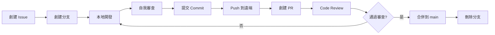

# 貢獻指南 (Contributing Guide)

感謝您對 **IT Project Process Management Platform** 的貢獻興趣! 本文件提供了參與專案開發的完整指南。

---

## 📋 目錄

- [開發環境設置](#開發環境設置)
- [開發工作流程](#開發工作流程)
- [分支命名規範](#分支命名規範)
- [Commit 訊息規範](#commit-訊息規範)
- [程式碼規範](#程式碼規範)
- [Pull Request 流程](#pull-request-流程)
- [Code Review 指南](#code-review-指南)
- [測試要求](#測試要求)
- [文檔撰寫](#文檔撰寫)

---

## 🚀 開發環境設置

請先閱讀並完成 [README.md](./README.md#快速開始) 和 [local-dev-setup.md](./docs/infrastructure/local-dev-setup.md) 中的設置步驟。

### 最小需求檢查清單

- ✅ Node.js 20.x LTS
- ✅ pnpm 8+
- ✅ Docker Desktop 運行中
- ✅ Git 配置完成
- ✅ VS Code + 推薦擴充套件

### 驗證環境設置

```bash
# 1. 確認所有相依套件已安裝
pnpm install

# 2. 確認 Docker 服務正常運行
docker-compose ps

# 3. 執行 Lint 和 Type Check
pnpm lint
pnpm typecheck

# 4. 執行測試
pnpm test

# 5. 啟動開發伺服器
pnpm dev
```

---

## 🔄 開發工作流程

### 標準開發流程



### 詳細步驟

#### 1. 創建或認領 Issue

在開始開發前，確保有對應的 GitHub Issue:

- 如果 Issue 不存在，先創建一個
- 在 Issue 中描述問題或功能需求
- 將 Issue 指派給自己

#### 2. 從 main 分支創建新分支

```bash
# 1. 確保 main 分支是最新的
git checkout main
git pull origin main

# 2. 創建並切換到新分支
git checkout -b feature/your-feature-name

# 命名規範見下方章節
```

#### 3. 本地開發

```bash
# 啟動開發伺服器
pnpm dev

# 在另一個終端監控類型錯誤
pnpm typecheck --watch

# 進行開發...
```

#### 4. 提交前自我審查

在提交 Commit 前，請執行以下檢查:

```bash
# 1. 格式化程式碼
pnpm format

# 2. 修復 Lint 錯誤
pnpm lint:fix

# 3. 執行類型檢查
pnpm typecheck

# 4. 執行測試
pnpm test

# 5. 如有修改 Prisma Schema, 確保生成 Client
pnpm prisma generate
```

#### 5. 提交 Commit

遵循 [Conventional Commits](#commit-訊息規範) 規範:

```bash
git add .
git commit -m "feat(api): add budget proposal creation endpoint"
```

#### 6. Push 到遠端

```bash
# 首次推送
git push -u origin feature/your-feature-name

# 後續推送
git push
```

#### 7. 創建 Pull Request

- 前往 GitHub Repository
- 點擊 "Compare & pull request"
- 填寫 PR Template (見下方)
- 關聯相關的 Issue: `Closes #123`
- 請求 Review

---

## 🌿 分支命名規範

### 分支類型與命名格式

| 類型 | 格式 | 範例 | 用途 |
|------|------|------|------|
| **Feature** | `feature/description` | `feature/budget-pool-crud` | 新功能開發 |
| **Fix** | `fix/description` | `fix/proposal-status-bug` | Bug 修復 |
| **Hotfix** | `hotfix/description` | `hotfix/security-patch` | 緊急修復 (生產環境) |
| **Refactor** | `refactor/description` | `refactor/api-error-handling` | 重構 (不改變功能) |
| **Docs** | `docs/description` | `docs/update-readme` | 文檔更新 |
| **Chore** | `chore/description` | `chore/upgrade-dependencies` | 雜項 (CI, 配置等) |
| **Test** | `test/description` | `test/add-proposal-tests` | 新增或修改測試 |

### 命名原則

- ✅ 使用小寫字母
- ✅ 使用連字號 (`-`) 分隔單詞
- ✅ 簡潔但具描述性 (建議 2-4 個單詞)
- ✅ 使用英文
- ❌ 不使用個人名稱 (如 `john-feature`)
- ❌ 不使用 Issue 編號作為整個分支名 (使用描述性名稱)

### 範例

```bash
# ✅ 好的命名
feature/user-authentication
fix/dashboard-loading-error
refactor/prisma-queries
docs/api-documentation

# ❌ 不好的命名
feature/issue-123          # 缺乏描述性
fix/bug                    # 太簡略
JohnFeature               # 包含個人名稱, 大小寫混用
feature/add_new_feature   # 使用底線而非連字號
```

---

## 💬 Commit 訊息規範

本專案採用 **[Conventional Commits](https://www.conventionalcommits.org/)** 規範。

### 基本格式

```
<type>(<scope>): <subject>

<body>

<footer>
```

### Type 類型

| Type | 說明 | 範例 |
|------|------|------|
| `feat` | 新功能 | `feat(api): add budget proposal endpoint` |
| `fix` | Bug 修復 | `fix(ui): resolve dashboard loading issue` |
| `docs` | 文檔變更 | `docs(readme): update setup instructions` |
| `style` | 格式變更 (不影響程式邏輯) | `style(api): format code with prettier` |
| `refactor` | 重構 (不是 feat 也不是 fix) | `refactor(db): optimize prisma queries` |
| `perf` | 效能優化 | `perf(api): add database indexing` |
| `test` | 新增或修改測試 | `test(proposal): add unit tests` |
| `chore` | 建置、工具、依賴等 | `chore(deps): upgrade next to 14.2` |
| `ci` | CI/CD 配置變更 | `ci(github): add test workflow` |
| `revert` | 回退先前的 Commit | `revert: revert feat(api): add endpoint` |

### Scope 範圍 (可選但建議)

| Scope | 說明 |
|-------|------|
| `api` | tRPC API 相關 |
| `db` | Prisma / Database 相關 |
| `ui` | 前端 UI 元件 |
| `auth` | 認證相關 |
| `dashboard` | 儀表板功能 |
| `proposal` | 提案功能 |
| `expense` | 費用功能 |
| `vendor` | 供應商功能 |
| `notification` | 通知系統 |
| `deps` | 依賴套件 |
| `ci` | CI/CD |
| `docs` | 文檔 |

### Subject 主題

- 使用**祈使句, 現在式**: "add" 而非 "added" 或 "adds"
- 首字母**小寫**
- 結尾**不加句號**
- 簡潔 (建議 ≤ 50 字元)

### Body 主體 (可選)

- 詳細說明**為什麼**做這個變更
- 說明**變更的影響範圍**
- 使用祈使句

### Footer 頁腳 (可選)

- **Breaking Changes**: 以 `BREAKING CHANGE:` 開頭
- **Issue 關聯**: `Closes #123`, `Fixes #456`, `Refs #789`

### 完整範例

```bash
# 簡單範例
git commit -m "feat(api): add budget pool creation endpoint"

# 包含 Scope 和 Body
git commit -m "fix(dashboard): resolve data loading race condition

Previously, the dashboard would occasionally show stale data due to
race conditions in the data fetching logic. This commit implements
proper loading states and data synchronization.

Fixes #234"

# Breaking Change
git commit -m "refactor(api)!: change proposal status enum values

BREAKING CHANGE: The proposal status values have been renamed:
- 'PENDING' -> 'PendingApproval'
- 'APPROVED' -> 'Approved'
- 'REJECTED' -> 'Rejected'

Clients must update their status handling logic.

Refs #345"

# 多行 Commit (使用編輯器)
git commit
# 然後在編輯器中輸入:
feat(notification): implement email notification system

Add SendGrid integration for sending automated email notifications
when proposal status changes. Includes the following templates:
- Proposal submitted
- Proposal approved
- Proposal rejected
- More information required

Closes #156
```

### Commit 頻率建議

- ✅ **小而頻繁**: 每個邏輯變更一個 Commit
- ✅ **可編譯**: 每個 Commit 都應該可以通過 build
- ✅ **有意義**: 每個 Commit 都應該是一個完整的邏輯單元
- ❌ 避免 "WIP" Commit 直接推送到共享分支

---

## 📝 程式碼規範

### TypeScript 規範

```typescript
// ✅ 好的做法
interface User {
  id: string;
  email: string;
  name: string | null;
}

async function getUserById(id: string): Promise<User> {
  const user = await prisma.user.findUnique({ where: { id } });
  if (!user) {
    throw new Error('User not found');
  }
  return user;
}

// ❌ 避免的做法
async function getUserById(id: any) {  // 避免 any
  const user = await prisma.user.findUnique({ where: { id } });
  return user;  // 缺少錯誤處理
}
```

### 命名規範

| 項目 | 規範 | 範例 |
|------|------|------|
| **變數/函數** | camelCase | `budgetPool`, `getUserById()` |
| **React 元件** | PascalCase | `BudgetPoolCard`, `DashboardLayout` |
| **TypeScript Type/Interface** | PascalCase | `User`, `BudgetProposal` |
| **常數** | UPPER_SNAKE_CASE | `MAX_FILE_SIZE`, `API_BASE_URL` |
| **檔案名稱** | kebab-case | `budget-pool.ts`, `user-dashboard.tsx` |
| **資料夾名稱** | kebab-case | `budget-pools/`, `user-management/` |

### 檔案結構規範

```typescript
// React Component 檔案結構
// apps/web/src/components/budget-pool-card.tsx

import { type FC } from 'react';
import { api } from '@/lib/trpc';

// 1. Type Definitions
interface BudgetPoolCardProps {
  id: string;
  name: string;
  totalAmount: number;
}

// 2. Component
export const BudgetPoolCard: FC<BudgetPoolCardProps> = ({
  id,
  name,
  totalAmount,
}) => {
  // Hooks
  const { data, isLoading } = api.budgetPool.getById.useQuery({ id });

  // Event Handlers
  const handleClick = () => {
    // ...
  };

  // Render
  if (isLoading) return <div>Loading...</div>;

  return (
    <div onClick={handleClick}>
      <h3>{name}</h3>
      <p>{totalAmount}</p>
    </div>
  );
};
```

### 註解規範

```typescript
// ✅ 好的註解: 解釋「為什麼」
// We use a transaction here to ensure atomicity when creating
// a proposal and locking the budget amount simultaneously
await prisma.$transaction([
  prisma.budgetProposal.create({ data: proposalData }),
  prisma.budgetPool.update({ where: { id }, data: { lockedAmount } }),
]);

// ❌ 不必要的註解: 說明顯而易見的事
// Increment counter by 1
counter++;
```

### Import 順序

```typescript
// 1. External dependencies
import { type NextPage } from 'next';
import { useState } from 'react';
import { z } from 'zod';

// 2. Internal - Absolute imports
import { api } from '@/lib/trpc';
import { Button } from '@/components/ui/button';

// 3. Internal - Relative imports
import { DashboardLayout } from '../layouts/dashboard-layout';
import { formatCurrency } from '../utils/format';

// 4. Types (if not inline)
import type { User } from '@/types';
```

---

## 🔍 Pull Request 流程

### PR 創建前檢查清單

- [ ] 程式碼已通過 `pnpm lint`
- [ ] 程式碼已通過 `pnpm typecheck`
- [ ] 所有測試通過 `pnpm test`
- [ ] 已新增相關的單元測試 (如適用)
- [ ] 已更新相關文檔 (如適用)
- [ ] Commit 訊息遵循 Conventional Commits
- [ ] 已在本地測試核心功能
- [ ] 已檢查是否有 Breaking Changes

### PR 標題規範

PR 標題應遵循 Conventional Commits 格式:

```
feat(api): add budget proposal CRUD endpoints
fix(dashboard): resolve infinite loading state
docs(readme): update environment setup instructions
```

### PR 描述 Template

創建 PR 時會自動套用以下範本:

```markdown
## 📝 變更摘要 (Summary)
<!-- 簡要描述這個 PR 做了什麼 -->

## 🎯 相關 Issue
<!-- 關聯的 Issue, 使用 Closes #123, Fixes #456, Refs #789 -->
Closes #

## 🛠️ 變更類型 (Type of Change)
- [ ] 🐛 Bug fix (non-breaking change which fixes an issue)
- [ ] ✨ New feature (non-breaking change which adds functionality)
- [ ] 💥 Breaking change (fix or feature that would cause existing functionality to not work as expected)
- [ ] 📝 Documentation update
- [ ] 🎨 Code refactoring (no functional changes)
- [ ] ⚡ Performance improvement
- [ ] ✅ Test updates

## 📋 測試 (Testing)
<!-- 描述你如何測試這些變更 -->

**測試步驟:**
1.
2.
3.

**測試環境:**
- [ ] Local Development
- [ ] Staging
- [ ] Production

## 📸 截圖 (Screenshots)
<!-- 如有 UI 變更, 請附上截圖 -->

## ✅ Checklist
- [ ] 我的程式碼遵循專案的程式碼規範
- [ ] 我已進行自我審查
- [ ] 我已新增對應的註解 (特別是複雜的邏輯)
- [ ] 我已更新相關文檔
- [ ] 我的變更沒有產生新的警告
- [ ] 我已新增測試證明修復有效或功能正常運作
- [ ] 新舊的單元測試在本地都通過

## 🔗 其他資訊 (Additional Context)
<!-- 任何其他相關資訊 -->
```

### PR 審查流程

1. **自動檢查**: GitHub Actions 會自動執行 Lint、Type Check、Tests
2. **Code Review**: 至少需要 **1 位** 團隊成員批准
3. **變更請求**: 如有變更請求, 請及時修改並推送新的 Commit
4. **合併**: 審查通過後, 使用 **Squash and Merge** 合併到 main

---

## 👀 Code Review 指南

### Review 者職責

作為 Reviewer, 請檢查以下項目:

#### 1. 程式碼品質
- [ ] 程式碼易讀、易理解
- [ ] 遵循專案程式碼規範
- [ ] 沒有明顯的 Bug 或邏輯錯誤
- [ ] 錯誤處理完善

#### 2. 架構與設計
- [ ] 符合專案架構設計
- [ ] 沒有過度工程 (Over-engineering)
- [ ] 元件/函數職責單一

#### 3. 安全性
- [ ] 沒有硬編碼的敏感資訊
- [ ] 輸入驗證完善 (Zod schemas)
- [ ] SQL Injection 防護 (Prisma 已處理)

#### 4. 效能
- [ ] 沒有 N+1 查詢問題
- [ ] 適當使用 React Hooks (避免不必要的 re-render)
- [ ] 大型列表使用分頁或虛擬滾動

#### 5. 測試
- [ ] 核心邏輯有測試覆蓋
- [ ] 測試案例有意義

### Review 留言規範

使用以下前綴標示留言性質:

- `[MUST]`: 必須修改
- `[SHOULD]`: 強烈建議修改
- `[NITS]`: 小問題, 可選擇性修改
- `[QUESTION]`: 詢問問題
- `[PRAISE]`: 正面肯定

**範例:**

```markdown
[MUST] 這裡缺少錯誤處理, 當 user 不存在時會導致應用崩潰。

[SHOULD] 建議將這段邏輯抽取為獨立的 utility function, 可提高可讀性。

[NITS] 變數命名可以更具描述性, 建議改為 `totalBudgetAmount`。

[QUESTION] 為什麼這裡使用 `useEffect` 而非直接在事件處理器中處理?

[PRAISE] 這個抽象設計得很好! 👍
```

---

## ✅ 測試要求

### 測試覆蓋率目標

- **核心業務邏輯**: 80%+
- **tRPC API Endpoints**: 80%+
- **UI 元件**: 60%+ (重要元件必須測試)

### 測試類型

#### 1. 單元測試 (Jest + React Testing Library)

```typescript
// packages/api/src/routers/budget-pool.test.ts
import { createInnerTRPCContext } from '../trpc';
import { appRouter } from './_app';

describe('budgetPool router', () => {
  it('should create a budget pool', async () => {
    const ctx = await createInnerTRPCContext({ session: mockSession });
    const caller = appRouter.createCaller(ctx);

    const result = await caller.budgetPool.create({
      name: 'FY2025 Budget',
      totalAmount: 100000,
      financialYear: 2025,
    });

    expect(result.name).toBe('FY2025 Budget');
  });
});
```

#### 2. 元件測試

```typescript
// apps/web/src/components/budget-pool-card.test.tsx
import { render, screen } from '@testing-library/react';
import { BudgetPoolCard } from './budget-pool-card';

describe('BudgetPoolCard', () => {
  it('should render budget pool name', () => {
    render(<BudgetPoolCard name="Test Pool" totalAmount={50000} />);
    expect(screen.getByText('Test Pool')).toBeInTheDocument();
  });
});
```

#### 3. E2E 測試 (Playwright)

```typescript
// apps/web/tests/e2e/proposal-workflow.spec.ts
import { test, expect } from '@playwright/test';

test('Project Manager can create and submit proposal', async ({ page }) => {
  await page.goto('/projects/123');
  await page.click('text=New Proposal');

  await page.fill('[name="title"]', 'Test Proposal');
  await page.fill('[name="amount"]', '10000');
  await page.click('button:has-text("Submit")');

  await expect(page.locator('text=Proposal submitted')).toBeVisible();
});
```

---

## 📚 文檔撰寫

### 何時需要更新文檔

- ✅ 新增 API Endpoint
- ✅ 修改環境變數
- ✅ 新增相依套件
- ✅ 架構變更
- ✅ 部署流程變更

### 文檔位置

| 文檔類型 | 位置 |
|---------|------|
| API 文檔 | `docs/api/` |
| 架構文檔 | `docs/fullstack-architecture/` |
| 基礎設施 | `docs/infrastructure/` |
| 使用者故事 | `docs/stories/` |
| README | 根目錄 `README.md` |

---

## 🙋 需要協助?

- 💬 **Teams**: #itpm-dev-support
- 📧 **Email**: dev-team@company.com
- 📖 **文檔**: [內部 Wiki](https://wiki.company.com/itpm)

---

**感謝您的貢獻! 🎉**
