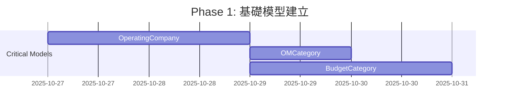
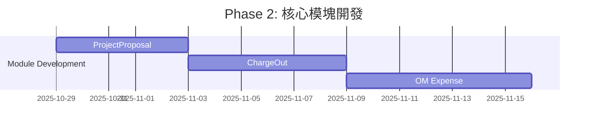

# 需求差異分析報告 (Requirement Gap Analysis)

> **生成日期**: 2025-10-26
> **分析者**: AI 助手
> **目的**: 比對用戶實際業務需求與現有系統實現的差異

---

## 📋 執行摘要 (Executive Summary)

本報告針對用戶提出的 8 個核心業務模塊進行了詳細的差異分析。現有系統已實現了基礎框架（MVP Phase 1），但與用戶的實際業務需求存在顯著差異，需要進行結構性調整和功能擴展。

### 關鍵發現

| 優先級 | 差異類型 | 影響範圍 | 建議行動 |
|--------|----------|---------|----------|
| 🔴 **Critical** | 缺少「費用轉嫁 (Charge Out)」完整模塊 | 模塊 6-7 | 立即新增獨立模型和工作流 |
| 🔴 **Critical** | 缺少「操作與維護費用管理」模塊 | 模塊 8 | 立即新增獨立模型和月度記錄 |
| 🔴 **Critical** | 缺少「項目計劃書」管理模塊 | 模塊 3 | 新增 ProjectProposal 模型 |
| 🟡 **High** | 預算池 (Budget Pool) 缺少預算類別分類 | 模塊 1 | 重構為多預算類別支持 |
| 🟡 **High** | 採購管理缺少表頭-明細結構 | 模塊 4 | 重構為 Header-Detail 模式 |
| 🟡 **High** | 支出/費用缺少預算類別關聯 | 模塊 5 | 新增 budgetCategory 欄位 |
| 🟢 **Medium** | 項目管理缺少部分欄位 | 模塊 2 | 新增請求/批准預算金額欄位 |
| 🟢 **Medium** | 缺少 OpCo (Operating Company) 概念 | 多個模塊 | 新增 OpCo 模型和關聯 |

---

## 📊 模塊對比分析

## 模塊 1: 預算池 (Budget Pool) 管理

### 👤 用戶需求

```yaml
欄位需求:
  - 預算類別 (Budget Category): 不同類別的預算金額和結餘
  - 關聯的項目: 該預算池下的所有項目
  - 關聯的支出類別: 該預算池支持的支出類別
  - 年度 (Financial Year): 哪一個財務年度
  - 預算金額: 各類別的總預算金額
  - 預算結餘: 各類別的剩餘金額

業務邏輯:
  - 一個預算池可以包含多個預算類別（如：Hardware, Software, Services）
  - 每個類別有獨立的預算金額和使用追蹤
  - 支出記錄時需要指定預算類別
```

### 💻 現有實現 (schema.prisma:91-103)

```prisma
model BudgetPool {
  id            String   @id @default(uuid())
  name          String
  totalAmount   Float      // ❌ 只有總金額，沒有分類
  usedAmount    Float      @default(0)
  financialYear Int        // ✅ 有年度欄位
  createdAt     DateTime   @default(now())
  updatedAt     DateTime   @updatedAt

  projects Project[]        // ✅ 有項目關聯
}
```

### 🔍 差異分析

| 功能需求 | 現有實現 | 差異 | 優先級 |
|---------|---------|------|--------|
| **預算類別分類** | ❌ 無 | 缺少多類別支持 | 🟡 High |
| **關聯的項目** | ✅ 有 | 已實現 | - |
| **關聯的支出類別** | ❌ 無 | 無法指定支持的支出類別 | 🟡 High |
| **財務年度** | ✅ 有 | 已實現 | - |
| **各類別預算金額** | ❌ 無 | 只有總金額 | 🟡 High |
| **各類別結餘** | ❌ 無 | 無法按類別追蹤 | 🟡 High |

### ✅ 改進建議

#### 方案 A: 新增 BudgetCategory 模型 (推薦)

```prisma
model BudgetPool {
  id            String   @id @default(uuid())
  name          String
  financialYear Int
  createdAt     DateTime @default(now())
  updatedAt     DateTime @updatedAt

  categories BudgetCategory[]  // 一個預算池包含多個類別
  projects   Project[]
}

model BudgetCategory {
  id           String  @id @default(uuid())
  budgetPoolId String
  categoryName String  // "Hardware", "Software", "Services", etc.
  totalAmount  Float
  usedAmount   Float   @default(0)
  description  String?
  createdAt    DateTime @default(now())
  updatedAt    DateTime @updatedAt

  budgetPool BudgetPool @relation(fields: [budgetPoolId], references: [id])
  expenses   Expense[]  // 支出記錄關聯到具體類別

  @@index([budgetPoolId])
  @@index([categoryName])
}
```

#### 方案 B: JSONB 結構存儲 (簡化版本)

```prisma
model BudgetPool {
  id            String   @id @default(uuid())
  name          String
  categories    Json     // { "Hardware": 100000, "Software": 50000 }
  financialYear Int
  createdAt     DateTime @default(now())
  updatedAt     DateTime @updatedAt

  projects Project[]
}
```

**推薦**: 方案 A - 提供更好的查詢能力和數據完整性。

---

## 模塊 2: 項目管理 (Project Management)

### 👤 用戶需求

```yaml
欄位需求:
  - 預算類別: 項目屬於哪個預算類別
  - 項目名稱: ✅ 已有
  - 項目描述: ✅ 已有
  - 項目負責人: ✅ 已有 (managerId)
  - 請求的預算金額: ❌ 缺少
  - 批准的預算金額: ❌ 缺少
  - 項目開始日期: ✅ 已有
  - 項目結束日期: ✅ 已有
  - 什麼年度的項目: 可從 budgetPool 獲取
  - 審核的進度/狀態: ✅ 已有 (status)
```

### 💻 現有實現 (schema.prisma:105-130)

```prisma
model Project {
  id            String    @id @default(uuid())
  name          String       // ✅
  description   String?      // ✅
  status        String       // ✅
  managerId     String       // ✅
  supervisorId  String       // ✅
  budgetPoolId  String       // ✅
  startDate     DateTime     // ✅
  endDate       DateTime?    // ✅
  chargeOutDate DateTime?    // Epic 6.4
  createdAt     DateTime
  updatedAt     DateTime

  manager        User     @relation("ProjectManager")
  supervisor     User     @relation("Supervisor")
  budgetPool     BudgetPool
  proposals      BudgetProposal[]
  quotes         Quote[]
  purchaseOrders PurchaseOrder[]
}
```

### 🔍 差異分析

| 功能需求 | 現有實現 | 差異 | 優先級 |
|---------|---------|------|--------|
| **預算類別** | ⚠️ 間接 | 透過 budgetPool 關聯，但無直接欄位 | 🟢 Medium |
| **請求的預算金額** | ❌ 無 | 缺少 requestedBudget | 🟢 Medium |
| **批准的預算金額** | ❌ 無 | 缺少 approvedBudget | 🟢 Medium |
| **審核進度/狀態** | ✅ 有 | status 欄位 | - |

### ✅ 改進建議

```prisma
model Project {
  id             String    @id @default(uuid())
  name           String
  description    String?
  status         String    @default("Draft")

  // ✅ 新增欄位
  budgetCategoryId String?  // 關聯到具體預算類別
  requestedBudget  Float?   // 請求的預算金額
  approvedBudget   Float?   // 批准的預算金額

  managerId      String
  supervisorId   String
  budgetPoolId   String
  startDate      DateTime
  endDate        DateTime?
  chargeOutDate  DateTime?
  createdAt      DateTime  @default(now())
  updatedAt      DateTime  @updatedAt

  manager        User             @relation("ProjectManager")
  supervisor     User             @relation("Supervisor")
  budgetPool     BudgetPool       @relation(fields: [budgetPoolId], references: [id])
  budgetCategory BudgetCategory?  @relation(fields: [budgetCategoryId], references: [id])
  proposals      BudgetProposal[]
  quotes         Quote[]
  purchaseOrders PurchaseOrder[]

  @@index([budgetCategoryId])
}
```

---

## 模塊 3: 項目計劃書 (Project Proposal)

### 👤 用戶需求

```yaml
欄位需求:
  - 關聯的項目: 哪個項目的計劃書
  - 計劃書的上傳檔案: PDF/PPT 文件
  - 誰負責介紹: 介紹人員
  - 會議記錄: 討論記錄
  - 會議日期: 會議時間
  - 批准的預算金額: 最終批准金額
  - 審核的狀態: Draft, Pending, Approved, Rejected
  - 審核成功的日期: 批准時間
  - 誰人批准: 批准者

注意:
  - 這與現有的 BudgetProposal (預算提案) 是不同的概念
  - ProjectProposal 是更詳細的項目計劃書
  - BudgetProposal 只是預算申請
```

### 💻 現有實現

**🔴 Critical**: 現有系統**完全缺少**此模塊！

目前只有 `BudgetProposal`（預算提案），但這與用戶需要的「項目計劃書」是不同的業務實體。

### 🔍 差異分析

| 功能需求 | 現有實現 | 差異 | 優先級 |
|---------|---------|------|--------|
| **項目計劃書模型** | ❌ 無 | 完全缺失 | 🔴 Critical |
| **上傳檔案** | ❌ 無 | 無法上傳計劃書文件 | 🔴 Critical |
| **會議記錄** | ❌ 無 | 無會議記錄功能 | 🔴 Critical |
| **批准工作流** | ⚠️ 部分 | BudgetProposal 有，但不適用 | 🔴 Critical |

### ✅ 改進建議

#### 新增 ProjectProposal 模型

```prisma
model ProjectProposal {
  id            String    @id @default(uuid())
  projectId     String

  // 計劃書文件
  filePath      String    // 上傳的 PDF/PPT 文件路徑
  fileName      String    // 原始文件名
  fileSize      Int?      // 文件大小

  // 會議相關
  presentedBy   String?   // 負責介紹的人員 (可能是 User ID 或姓名)
  meetingNotes  String?   @db.Text  // 會議記錄
  meetingDate   DateTime? // 會議日期

  // 預算相關
  approvedBudget Float?   // 批准的預算金額

  // 審核狀態
  status        String    @default("Draft")  // Draft, Pending, Approved, Rejected
  approvedBy    String?   // 批准者 User ID
  approvedAt    DateTime? // 審核成功的日期
  rejectionReason String? @db.Text  // 拒絕原因

  createdAt     DateTime  @default(now())
  updatedAt     DateTime  @updatedAt

  project       Project   @relation(fields: [projectId], references: [id])
  approver      User?     @relation("ProposalApprover", fields: [approvedBy], references: [id])
  comments      ProposalComment[]
  history       ProposalHistory[]

  @@index([projectId])
  @@index([status])
  @@index([approvedBy])
}

model ProposalComment {
  id                 String   @id @default(uuid())
  content            String   @db.Text
  userId             String
  projectProposalId  String
  createdAt          DateTime @default(now())

  user             User             @relation(fields: [userId], references: [id])
  projectProposal  ProjectProposal  @relation(fields: [projectProposalId], references: [id])

  @@index([projectProposalId])
  @@index([userId])
}

model ProposalHistory {
  id                 String   @id @default(uuid())
  action             String   // "SUBMITTED", "APPROVED", "REJECTED"
  details            String?  @db.Text
  userId             String
  projectProposalId  String
  createdAt          DateTime @default(now())

  user             User             @relation(fields: [userId], references: [id])
  projectProposal  ProjectProposal  @relation(fields: [projectProposalId], references: [id])

  @@index([projectProposalId])
  @@index([userId])
}
```

**前端頁面需求**:
- `/project-proposals` - 列表頁
- `/project-proposals/new` - 新增頁（文件上傳）
- `/project-proposals/[id]` - 詳情頁（顯示文件、會議記錄）
- `/project-proposals/[id]/edit` - 編輯頁

---

## 模塊 4: 採購管理 (Purchase Order)

### 👤 用戶需求

```yaml
結構需求:
  - 應該是包含表頭和明細的 (Header-Detail Pattern)

表頭欄位:
  - 採購單號: ✅ 已有 (poNumber)
  - 日期: ✅ 已有 (date)
  - 總金額: ✅ 已有 (totalAmount)
  - 關聯的項目: ✅ 已有 (projectId)
  - 關聯的供應商: ✅ 已有 (vendorId)
  - 名稱: ❌ 缺少
  - 描述: ❌ 缺少

明細欄位:
  - 項目名稱
  - 項目描述
  - 數量
  - 單價
  - 小計
  - 對應的支出/費用記錄: ✅ 已有 (expenses)
```

### 💻 現有實現 (schema.prisma:181-198)

```prisma
model PurchaseOrder {
  id          String   @id @default(uuid())
  poNumber    String   @unique @default(cuid())
  date        DateTime @default(now())
  totalAmount Float
  projectId   String
  vendorId    String
  createdAt   DateTime @default(now())
  updatedAt   DateTime @updatedAt

  project  Project   @relation(fields: [projectId], references: [id])
  vendor   Vendor    @relation(fields: [vendorId], references: [id])
  quote    Quote?
  expenses Expense[]

  @@index([projectId])
  @@index([vendorId])
}
```

### 🔍 差異分析

| 功能需求 | 現有實現 | 差異 | 優先級 |
|---------|---------|------|--------|
| **表頭-明細結構** | ❌ 無 | 只有表頭，沒有明細 | 🟡 High |
| **採購單名稱** | ❌ 無 | 缺少 name 欄位 | 🟢 Medium |
| **採購單描述** | ❌ 無 | 缺少 description 欄位 | 🟢 Medium |
| **明細項目** | ❌ 無 | 無法記錄多個採購項目 | 🟡 High |
| **數量/單價** | ❌ 無 | 無法分項記錄 | 🟡 High |

### ✅ 改進建議

```prisma
// 表頭 (Header)
model PurchaseOrder {
  id          String   @id @default(uuid())
  poNumber    String   @unique @default(cuid())
  name        String   // ✅ 新增：採購單名稱
  description String?  // ✅ 新增：採購單描述
  date        DateTime @default(now())
  totalAmount Float    // 自動計算或手動輸入
  projectId   String
  vendorId    String
  status      String   @default("Draft")  // Draft, Sent, Confirmed, Received
  createdAt   DateTime @default(now())
  updatedAt   DateTime @updatedAt

  project  Project         @relation(fields: [projectId], references: [id])
  vendor   Vendor          @relation(fields: [vendorId], references: [id])
  quote    Quote?
  items    PurchaseOrderItem[]  // ✅ 新增：明細項目
  expenses Expense[]

  @@index([projectId])
  @@index([vendorId])
  @@index([status])
}

// ✅ 新增：明細 (Detail)
model PurchaseOrderItem {
  id              String   @id @default(uuid())
  purchaseOrderId String
  itemName        String   // 項目名稱
  description     String?  // 項目描述
  quantity        Float    // 數量
  unitPrice       Float    // 單價
  subtotal        Float    // 小計 (quantity * unitPrice)
  category        String?  // 項目類別 (可選)
  createdAt       DateTime @default(now())
  updatedAt       DateTime @updatedAt

  purchaseOrder PurchaseOrder @relation(fields: [purchaseOrderId], references: [id], onDelete: Cascade)

  @@index([purchaseOrderId])
}
```

**前端改進**:
- 採購單編輯頁需要支持動態添加/刪除明細項目
- 自動計算總金額（sum of all subtotals）
- 明細表格可編輯

---

## 模塊 5: 支出/費用管理 (Expense Management)

### 👤 用戶需求

```yaml
結構需求:
  - 應該是包含表頭和明細的 (Header-Detail Pattern)

表頭欄位:
  - 支出名稱: ❌ 缺少
  - 描述: ❌ 缺少
  - 關聯項目: ✅ 透過 PO 間接關聯
  - 關聯預算類別: ❌ 缺少 (Critical)
  - 發票號碼: ❌ 缺少
  - 發票總金額: ✅ 有 (amount)
  - 是否需要收回費用 (charge out): ❌ 缺少
  - 發票日期: ✅ 有 (expenseDate)
  - 是否 operation maintenance: ❌ 缺少
  - 供應商名稱/關聯的供應商記錄: ✅ 透過 PO 間接關聯

明細欄位:
  - 費用項目名稱
  - 費用項目描述
  - 數量
  - 單價
  - 小計
```

### 💻 現有實現 (schema.prisma:200-214)

```prisma
model Expense {
  id              String   @id @default(uuid())
  invoiceFilePath String?
  amount          Float
  expenseDate     DateTime
  status          String   @default("Draft")
  purchaseOrderId String
  createdAt       DateTime @default(now())
  updatedAt       DateTime @updatedAt

  purchaseOrder PurchaseOrder @relation(fields: [purchaseOrderId], references: [id])

  @@index([purchaseOrderId])
  @@index([status])
}
```

### 🔍 差異分析

| 功能需求 | 現有實現 | 差異 | 優先級 |
|---------|---------|------|--------|
| **表頭-明細結構** | ❌ 無 | 只有表頭，沒有明細 | 🟡 High |
| **支出名稱** | ❌ 無 | 缺少 name 欄位 | 🟢 Medium |
| **描述** | ❌ 無 | 缺少 description 欄位 | 🟢 Medium |
| **關聯預算類別** | ❌ 無 | **Critical - 無法按類別追蹤** | 🔴 Critical |
| **發票號碼** | ❌ 無 | 只有文件路徑，無號碼 | 🟡 High |
| **是否 charge out** | ❌ 無 | 缺少業務關鍵欄位 | 🔴 Critical |
| **是否 O&M** | ❌ 無 | 無法區分運維費用 | 🟡 High |
| **明細項目** | ❌ 無 | 無法分項記錄費用 | 🟡 High |

### ✅ 改進建議

```prisma
// 表頭 (Header)
model Expense {
  id               String    @id @default(uuid())

  // ✅ 新增：基本信息
  name             String    // 支出名稱
  description      String?   // 支出描述

  // ✅ 新增：關聯
  budgetCategoryId String?   // 關聯預算類別 (CRITICAL)
  projectId        String?   // 直接關聯項目（可選，因為也可透過 PO）

  // ✅ 新增：發票信息
  invoiceNumber    String?   // 發票號碼
  invoiceFilePath  String?   // 發票文件路徑
  invoiceDate      DateTime? // 發票日期
  amount           Float     // 發票總金額

  // ✅ 新增：業務欄位
  requiresChargeOut Boolean  @default(false)  // 是否需要收回費用
  isOperationMaint  Boolean  @default(false)  // 是否為運維費用

  // 現有欄位
  expenseDate      DateTime
  status           String    @default("Draft")
  purchaseOrderId  String

  createdAt        DateTime  @default(now())
  updatedAt        DateTime  @updatedAt

  purchaseOrder  PurchaseOrder   @relation(fields: [purchaseOrderId], references: [id])
  budgetCategory BudgetCategory? @relation(fields: [budgetCategoryId], references: [id])
  project        Project?        @relation(fields: [projectId], references: [id])
  items          ExpenseItem[]   // ✅ 新增：明細項目
  chargeOuts     ChargeOut[]     // ✅ 新增：關聯的費用轉嫁記錄

  @@index([purchaseOrderId])
  @@index([status])
  @@index([budgetCategoryId])
  @@index([projectId])
  @@index([requiresChargeOut])
  @@index([isOperationMaint])
}

// ✅ 新增：明細 (Detail)
model ExpenseItem {
  id          String   @id @default(uuid())
  expenseId   String
  itemName    String   // 費用項目名稱
  description String?  // 費用項目描述
  quantity    Float    // 數量
  unitPrice   Float    // 單價
  subtotal    Float    // 小計
  category    String?  // 費用項目類別
  createdAt   DateTime @default(now())
  updatedAt   DateTime @updatedAt

  expense Expense @relation(fields: [expenseId], references: [id], onDelete: Cascade)

  @@index([expenseId])
}
```

---

## 模塊 6: 費用轉嫁 (Charge Out)

### 👤 用戶需求

```yaml
結構需求:
  - 應該是包含表頭和明細的嗎？(用戶疑問)

表頭欄位:
  - 名稱: Charge Out 名稱
  - 描述: Charge Out 描述
  - 關聯的項目: 哪個項目的費用轉嫁
  - 關聯的支出/費用: 哪些費用需要轉嫁
  - OpCo 名稱 (Operating Company): 轉嫁給哪個營運公司
  - 金額: 轉嫁金額
  - Debit Note 號碼: 借項通知書號碼
  - 收款日期: 何時收到款項
```

### 💻 現有實現

**🔴 Critical**: 現有系統**完全缺少**此模塊！

只有 `Project` 模型中有一個 `chargeOutDate` 欄位，但沒有完整的 Charge Out 管理功能。

### 🔍 差異分析

| 功能需求 | 現有實現 | 差異 | 優先級 |
|---------|---------|------|--------|
| **Charge Out 模型** | ❌ 無 | 完全缺失 | 🔴 Critical |
| **OpCo 概念** | ❌ 無 | 無營運公司管理 | 🔴 Critical |
| **Debit Note** | ❌ 無 | 無借項通知書管理 | 🔴 Critical |
| **收款追蹤** | ❌ 無 | 無法追蹤收款狀態 | 🔴 Critical |

### ✅ 改進建議

#### 結構建議：表頭-明細模式

**建議使用表頭-明細結構**，因為：
- 一次 Charge Out 可能包含多筆費用
- 需要分項追蹤每筆費用的轉嫁狀態
- 便於審計和對帳

```prisma
// ✅ 新增：OpCo (Operating Company) 模型
model OperatingCompany {
  id          String   @id @default(uuid())
  code        String   @unique  // 公司代碼 (如: HK01, CN02)
  name        String             // 公司名稱
  fullName    String?            // 公司全稱
  country     String?            // 所在國家
  currency    String   @default("HKD")  // 貨幣
  isActive    Boolean  @default(true)
  createdAt   DateTime @default(now())
  updatedAt   DateTime @updatedAt

  chargeOuts  ChargeOut[]
  opexRecords OperationMaintenanceExpense[]

  @@index([code])
  @@index([isActive])
}

// ✅ 新增：費用轉嫁表頭 (Header)
model ChargeOut {
  id               String    @id @default(uuid())

  // 基本信息
  name             String    // Charge Out 名稱
  description      String?   // Charge Out 描述

  // 關聯
  projectId        String    // 關聯的項目
  opCoId           String    // 轉嫁給哪個 Operating Company

  // 金額信息
  totalAmount      Float     // 總轉嫁金額

  // Debit Note 信息
  debitNoteNumber  String?   @unique  // 借項通知書號碼
  debitNoteDate    DateTime? // 借項通知書日期
  debitNoteFile    String?   // 借項通知書文件

  // 收款信息
  paymentReceived  Boolean   @default(false)  // 是否已收款
  paymentDate      DateTime? // 收款日期
  paymentAmount    Float?    // 實際收款金額

  // 狀態
  status           String    @default("Draft")  // Draft, Pending, Sent, Paid, Cancelled

  createdAt        DateTime  @default(now())
  updatedAt        DateTime  @updatedAt

  project          Project           @relation(fields: [projectId], references: [id])
  opCo             OperatingCompany  @relation(fields: [opCoId], references: [id])
  items            ChargeOutItem[]   // 明細項目
  confirmations    ChargeOutConfirmation[]  // 確認記錄

  @@index([projectId])
  @@index([opCoId])
  @@index([status])
  @@index([paymentReceived])
}

// ✅ 新增：費用轉嫁明細 (Detail)
model ChargeOutItem {
  id           String   @id @default(uuid())
  chargeOutId  String
  expenseId    String   // 關聯的支出/費用
  description  String?  // 明細描述
  amount       Float    // 轉嫁金額
  createdAt    DateTime @default(now())
  updatedAt    DateTime @updatedAt

  chargeOut ChargeOut @relation(fields: [chargeOutId], references: [id], onDelete: Cascade)
  expense   Expense   @relation(fields: [expenseId], references: [id])

  @@index([chargeOutId])
  @@index([expenseId])
}
```

**前端頁面需求**:
- `/charge-outs` - 列表頁
- `/charge-outs/new` - 新增頁（選擇費用、OpCo）
- `/charge-outs/[id]` - 詳情頁（顯示 Debit Note、收款狀態）
- `/charge-outs/[id]/edit` - 編輯頁

---

## 模塊 7: 費用轉嫁確認 (Charge Out Confirmation)

### 👤 用戶需求

```yaml
疑問:
  - 費用轉嫁記錄生成後，也需要通過確認/審核
  - 是否需要另外一張表單去管理？

可能需求:
  - 確認狀態
  - 確認者
  - 確認日期
  - 確認意見
  - 附件/證明文件
```

### 💻 現有實現

**🔴 Critical**: 完全缺失

### 🔍 分析與建議

#### 方案 A: 獨立確認表 (推薦用於複雜審核流程)

適用於：需要多級審核、詳細記錄確認過程

```prisma
model ChargeOutConfirmation {
  id              String    @id @default(uuid())
  chargeOutId     String

  // 確認信息
  status          String    @default("Pending")  // Pending, Confirmed, Rejected
  confirmedBy     String?   // 確認者 User ID
  confirmedAt     DateTime? // 確認日期
  comments        String?   @db.Text  // 確認意見
  attachmentPath  String?   // 證明文件路徑

  // 審核級別 (如果需要多級審核)
  level           Int       @default(1)  // 1=初審, 2=複審, 3=終審

  createdAt       DateTime  @default(now())
  updatedAt       DateTime  @updatedAt

  chargeOut       ChargeOut @relation(fields: [chargeOutId], references: [id])
  confirmer       User?     @relation("ChargeOutConfirmer", fields: [confirmedBy], references: [id])

  @@index([chargeOutId])
  @@index([status])
  @@index([confirmedBy])
}
```

#### 方案 B: 在 ChargeOut 表中添加欄位 (簡化版本)

適用於：簡單的單級確認

```prisma
model ChargeOut {
  // ... 現有欄位 ...

  // ✅ 新增確認欄位
  confirmationStatus String    @default("Pending")  // Pending, Confirmed, Rejected
  confirmedBy        String?   // 確認者 User ID
  confirmedAt        DateTime? // 確認日期
  confirmationNotes  String?   @db.Text  // 確認意見

  confirmer          User?     @relation("ChargeOutConfirmer", fields: [confirmedBy], references: [id])
}
```

**推薦**:
- 如果需要複雜的多級審核 → 方案 A
- 如果只是簡單確認 → 方案 B

---

## 模塊 8: 操作與維護費用管理 (Operation & Maintenance Expense)

### 👤 用戶需求

```yaml
結構需求:
  - 應該是包含表頭和明細的

表頭欄位:
  - 名稱: O&M 費用名稱
  - 描述: O&M 費用描述
  - 年度: 財務年度
  - 操作與維護類別: O&M 類別
  - 關聯的供應商: 供應商
  - 預算金額: 年度預算
  - 實際支出金額: 實際總支出
  - 增長率 (對比上年度): YoY 增長率
  - 哪一個 OpCo 持有的費用: Operating Company
  - 開始日期: 合約開始日期
  - 終結日期: 合約結束日期

明細欄位:
  - 每個月份的實際支出記錄 (1-12月)
  - 每月需要記錄: 月份, 實際金額, 備註
```

### 💻 現有實現

**🔴 Critical**: 現有系統**完全缺少**此模塊！

### 🔍 差異分析

| 功能需求 | 現有實現 | 差異 | 優先級 |
|---------|---------|------|--------|
| **O&M 模型** | ❌ 無 | 完全缺失 | 🔴 Critical |
| **O&M 類別** | ❌ 無 | 無法分類管理 | 🔴 Critical |
| **月度記錄** | ❌ 無 | 無法追蹤月度支出 | 🔴 Critical |
| **YoY 增長率** | ❌ 無 | 無法比較年度增長 | 🟡 High |
| **OpCo 關聯** | ❌ 無 | 無法按 OpCo 管理 | 🔴 Critical |

### ✅ 改進建議

```prisma
// ✅ 新增：O&M 類別
model OMCategory {
  id          String   @id @default(uuid())
  code        String   @unique  // 類別代碼
  name        String              // 類別名稱
  description String?             // 類別描述
  isActive    Boolean  @default(true)
  createdAt   DateTime @default(now())
  updatedAt   DateTime @updatedAt

  expenses OperationMaintenanceExpense[]

  @@index([code])
  @@index([isActive])
}

// ✅ 新增：操作與維護費用表頭 (Header)
model OperationMaintenanceExpense {
  id              String    @id @default(uuid())

  // 基本信息
  name            String    // O&M 費用名稱
  description     String?   // O&M 費用描述

  // 分類
  financialYear   Int       // 財務年度
  categoryId      String    // O&M 類別

  // 供應商
  vendorId        String    // 關聯的供應商

  // 金額
  budgetAmount    Float     // 年度預算金額
  actualAmount    Float     @default(0)  // 實際總支出（自動計算）

  // 增長率
  previousYearAmount Float?  // 上年度金額
  growthRate         Float?  // 增長率 (%)

  // Operating Company
  opCoId          String    // 哪個 OpCo 持有

  // 合約日期
  startDate       DateTime  // 合約開始日期
  endDate         DateTime? // 合約結束日期

  // 狀態
  status          String    @default("Active")  // Active, Expired, Cancelled

  createdAt       DateTime  @default(now())
  updatedAt       DateTime  @updatedAt

  category        OMCategory        @relation(fields: [categoryId], references: [id])
  vendor          Vendor            @relation(fields: [vendorId], references: [id])
  opCo            OperatingCompany  @relation(fields: [opCoId], references: [id])
  monthlyRecords  OMMonthlyRecord[] // 月度記錄

  @@index([financialYear])
  @@index([categoryId])
  @@index([vendorId])
  @@index([opCoId])
  @@index([status])
}

// ✅ 新增：月度實際支出記錄 (Detail)
model OMMonthlyRecord {
  id       String   @id @default(uuid())
  omId     String   // 關聯的 O&M 費用

  // 月份信息
  year     Int      // 年份
  month    Int      // 月份 (1-12)

  // 金額
  actualAmount Float // 實際支出金額

  // 備註
  notes    String?  @db.Text  // 備註說明

  // 支持文件
  invoiceNumber String?  // 發票號碼
  invoiceFile   String?  // 發票文件路徑

  createdAt DateTime @default(now())
  updatedAt DateTime @updatedAt

  omExpense OperationMaintenanceExpense @relation(fields: [omId], references: [id], onDelete: Cascade)

  @@unique([omId, year, month])  // 確保每個月只有一條記錄
  @@index([omId])
  @@index([year, month])
}
```

**前端頁面需求**:
- `/om-expenses` - 列表頁（顯示所有 O&M 費用）
- `/om-expenses/new` - 新增頁
- `/om-expenses/[id]` - 詳情頁（顯示月度記錄表格）
- `/om-expenses/[id]/edit` - 編輯頁
- `/om-expenses/[id]/monthly` - 月度記錄維護頁（12個月的表格）

**特殊功能**:
- 月度記錄表格可快速輸入（1-12月）
- 自動計算總支出（sum of monthly records）
- 自動計算增長率（if previousYearAmount exists）
- 月度趨勢圖表（Chart.js 或 Recharts）

---

## 📋 總體改進方案優先級

### 🔴 Critical Priority (立即實施)

1. **新增模塊 3: 項目計劃書 (ProjectProposal)**
   - 影響: 無法管理項目計劃書
   - 估計工時: 3-5 天
   - 依賴: 無

2. **新增模塊 6: 費用轉嫁 (ChargeOut + ChargeOutItem)**
   - 影響: 核心業務流程缺失
   - 估計工時: 4-6 天
   - 依賴: OpCo 模型

3. **新增模塊 8: 操作與維護費用管理 (OM Expense + Monthly Records)**
   - 影響: 無法管理運維費用
   - 估計工時: 5-7 天
   - 依賴: OpCo 模型、OMCategory 模型

4. **Expense 模型重構**
   - 新增: budgetCategoryId, name, description, invoiceNumber
   - 新增: requiresChargeOut, isOperationMaint
   - 新增: ExpenseItem 明細表
   - 估計工時: 2-3 天
   - 依賴: BudgetCategory

5. **新增 OperatingCompany (OpCo) 模型**
   - 影響: ChargeOut 和 OM Expense 需要
   - 估計工時: 1-2 天
   - 依賴: 無

---

### 🟡 High Priority (短期實施)

6. **BudgetPool 重構為多類別支持**
   - 新增: BudgetCategory 模型
   - 重構: BudgetPool 關聯
   - 估計工時: 3-4 天
   - 依賴: 需要數據遷移

7. **PurchaseOrder 新增表頭-明細結構**
   - 新增: name, description, status
   - 新增: PurchaseOrderItem 明細表
   - 估計工時: 2-3 天
   - 依賴: 無

---

### 🟢 Medium Priority (中期優化)

8. **Project 模型新增欄位**
   - 新增: budgetCategoryId, requestedBudget, approvedBudget
   - 估計工時: 1 天
   - 依賴: BudgetCategory

9. **ChargeOut 確認機制**
   - 新增: ChargeOutConfirmation 模型（或欄位）
   - 估計工時: 2 天
   - 依賴: ChargeOut 模型

---

## 📊 實施路線圖建議

### Phase 1: 基礎模型建立 (Week 1-2)



**任務列表**:
1. ✅ 新增 OperatingCompany 模型
2. ✅ 新增 OMCategory 模型
3. ✅ 新增 BudgetCategory 模型
4. ✅ 執行數據庫遷移

### Phase 2: 核心模塊開發 (Week 3-6)



**任務列表**:
1. ✅ ProjectProposal (模塊 3)
   - Schema 定義
   - API 開發
   - 前端頁面 (4頁)

2. ✅ ChargeOut (模塊 6)
   - ChargeOut + ChargeOutItem Schema
   - API 開發
   - 前端頁面 (4頁)

3. ✅ OM Expense (模塊 8)
   - OM Expense + Monthly Record Schema
   - API 開發
   - 前端頁面 (5頁)
   - 月度記錄表格組件

### Phase 3: 模型重構與優化 (Week 7-9)

**任務列表**:
1. ✅ BudgetPool 重構（多類別）
2. ✅ Expense 模型重構（新增欄位 + 明細）
3. ✅ PurchaseOrder 重構（表頭-明細）
4. ✅ Project 模型新增欄位
5. ✅ ChargeOut 確認機制

### Phase 4: 測試與優化 (Week 10)

**任務列表**:
1. ✅ 整合測試
2. ✅ 數據完整性測試
3. ✅ 用戶驗收測試
4. ✅ 性能優化
5. ✅ 文檔更新

---

## 🎯 總結與建議

### 關鍵發現

1. **現有系統已實現的部分**:
   - ✅ 基礎的預算池管理
   - ✅ 項目管理（但缺少部分欄位）
   - ✅ 預算提案工作流（BudgetProposal，但與 ProjectProposal 不同）
   - ✅ 供應商管理
   - ✅ 採購單管理（但缺少明細）
   - ✅ 費用管理（但缺少關鍵欄位和明細）

2. **現有系統缺少的部分**:
   - ❌ 項目計劃書管理（ProjectProposal）
   - ❌ 費用轉嫁管理（ChargeOut）
   - ❌ 操作與維護費用管理（OM Expense）
   - ❌ Operating Company (OpCo) 概念
   - ❌ 預算類別分類
   - ❌ 表頭-明細結構（PO 和 Expense）

3. **架構層面的改進需求**:
   - 從單一金額 → 分類金額管理
   - 從簡單記錄 → 表頭-明細結構
   - 從項目內部 → 跨 OpCo 管理

### 優先建議

**立即行動**:
1. 先實現 OperatingCompany 模型（其他模塊依賴）
2. 新增 ProjectProposal 模塊（業務必需）
3. 新增 ChargeOut 模塊（業務必需）
4. 新增 OM Expense 模塊（業務必需）

**短期優化**:
1. 重構 BudgetPool 支持多類別
2. 重構 Expense 添加明細和業務欄位
3. 重構 PurchaseOrder 添加明細

**中期完善**:
1. 完善確認機制
2. 優化用戶體驗
3. 增強報表功能

---

## 📞 下一步行動

建議與用戶確認：

1. **確認業務優先級**:
   - 以上 8 個模塊中，哪些是最急需的？
   - 是否同意建議的實施順序？

2. **確認技術細節**:
   - 表頭-明細結構是否符合業務需求？
   - OpCo 管理的粒度是否足夠？
   - 月度記錄的維護方式是否合適？

3. **制定實施計劃**:
   - 確定開發時程
   - 分配開發資源
   - 設定里程碑和驗收標準

4. **數據遷移策略**:
   - 現有數據如何遷移到新結構？
   - 是否需要保留歷史數據？
   - 遷移時機和方法？

---

**報告結束**

---

## 附錄 A: 完整 Schema 建議

由於篇幅限制，完整的 Prisma Schema 建議請參見單獨文檔：
- `PROPOSED-SCHEMA.md` - 完整的 Schema 定義
- `MIGRATION-GUIDE.md` - 數據遷移指南
- `API-DESIGN-SPEC.md` - API 設計規範

