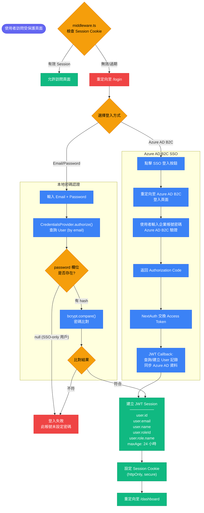
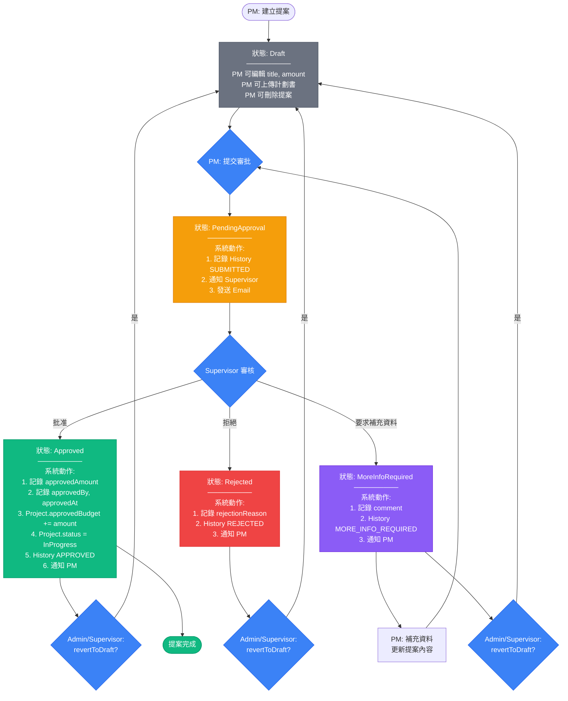
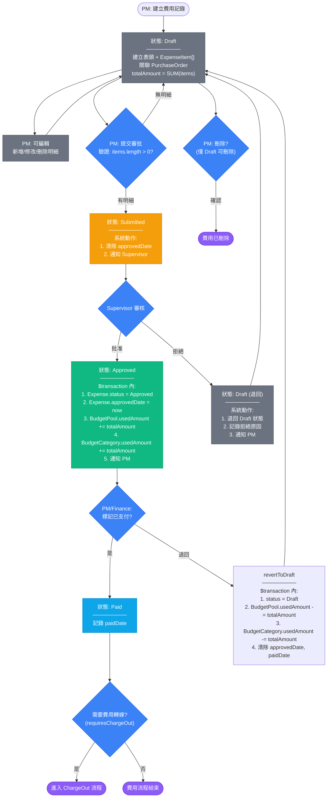
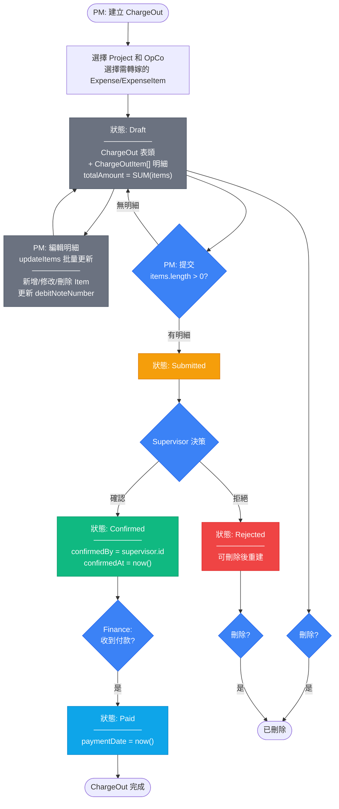
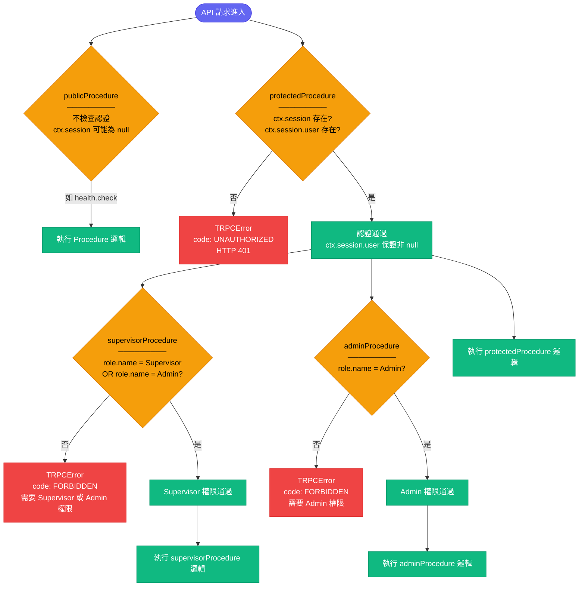
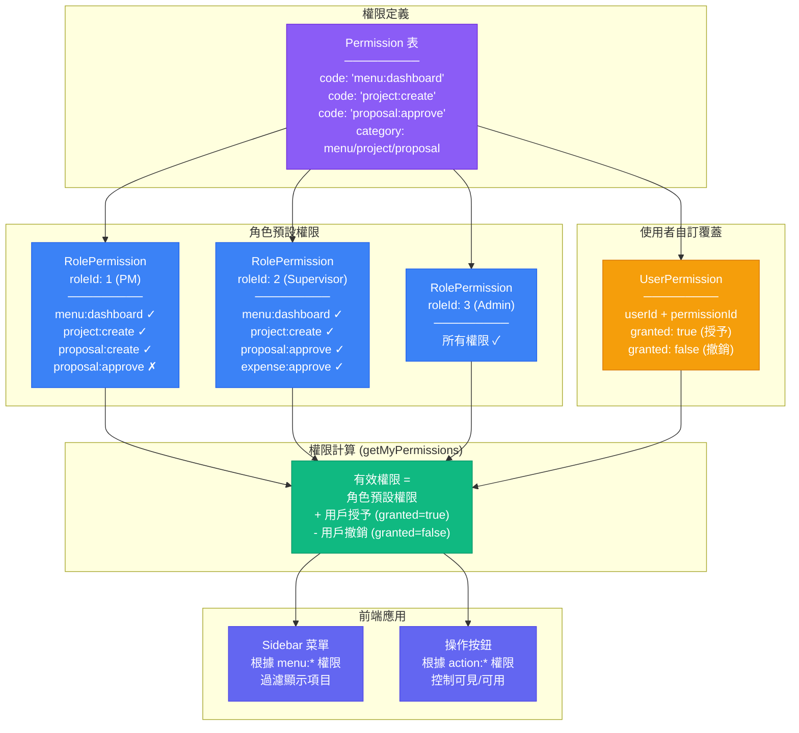
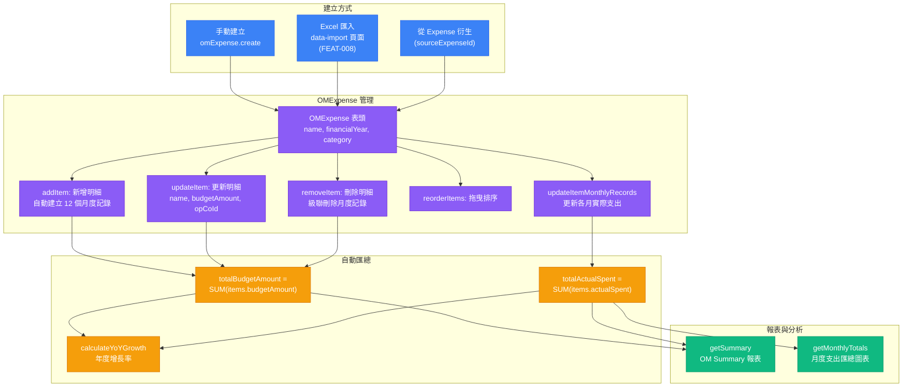

# 業務流程圖

本文件描述 IT 專案流程管理平台的各項業務流程，包含認證流程、審批工作流、權限控制決策樹等。所有流程圖均基於實際程式碼驗證。

---

## 1. 使用者認證流程

此圖展示平台支援的兩種認證方式：Azure AD B2C SSO (企業環境) 和本地密碼登入 (開發/備援)。認證成功後統一建立 JWT Session。資料來源為 `packages/auth/src/index.ts`。

---

## 2. 預算提案審批工作流

此圖展示 BudgetProposal 的完整業務流程，包含各個角色的操作和系統自動化動作。資料來源為 `budgetProposal.ts` router。

---

## 3. 費用審批與支付工作流

此圖展示 Expense 從建立到支付的完整業務流程，包含預算自動扣款邏輯。資料來源為 `expense.ts` router。

---

## 4. ChargeOut 確認工作流

此圖展示費用轉嫁 (ChargeOut) 從建立到付款的完整流程。資料來源為 `chargeOut.ts` router。

---

## 5. 角色權限控制決策樹 (RBAC)

此圖展示 tRPC procedure 中介層如何檢查使用者權限。三層 procedure 構成遞進式的權限檢查鏈。資料來源為 `packages/api/src/trpc.ts`。

### 各 Procedure 類型的使用場景

| Procedure 類型 | 使用的 Router | 操作 |
|---------------|--------------|------|
| `publicProcedure` | health | diagnose, getConfig |
| `protectedProcedure` | project, budgetPool, budgetProposal, expense, purchaseOrder, quote, vendor, notification, omExpense, chargeOut, currency, operatingCompany, expenseCategory, dashboard | 大部分 CRUD 操作 |
| `supervisorProcedure` | budgetProposal (approve), expense (approve, reject), chargeOut (confirm, reject) | 審批/確認操作 |
| `adminProcedure` | user (create, delete), permission (setUserPermission, setUserPermissions, getRolePermissions) | 系統管理操作 |

---

## 6. FEAT-011 權限管理流程

此圖展示 FEAT-011 實作的細粒度權限系統，包含角色預設權限和使用者自訂覆蓋。資料來源為 `permission.ts` router 和 schema.prisma 的 Permission、RolePermission、UserPermission model。

---

## 7. 完整專案生命週期

此圖展示一個 IT 專案從預算規劃到費用轉嫁的完整端到端業務流程。

```mermaid
flowchart LR
    subgraph "Phase 1: 預算規劃"
        BP_CREATE["建立 BudgetPool<br/>(financialYear)"]
        BC_CREATE["建立 BudgetCategory<br/>(Hardware, Software...)"]
        PROJ_CREATE["建立 Project<br/>(projectCode, managerId)"]
    end

    subgraph "Phase 2: 提案審批"
        PROP_CREATE["建立 BudgetProposal"]
        PROP_SUBMIT["提交審批"]
        PROP_APPROVE["Supervisor 批准<br/>→ Project.status = InProgress"]
    end

    subgraph "Phase 3: 採購執行"
        VEN_SELECT["選擇 Vendor"]
        QUO_UPLOAD["上傳 Quote"]
        PO_CREATE["建立 PurchaseOrder<br/>+ PurchaseOrderItem[]"]
    end

    subgraph "Phase 4: 費用記錄"
        EXP_CREATE["建立 Expense<br/>+ ExpenseItem[]"]
        EXP_SUBMIT["提交費用審批"]
        EXP_APPROVE["Supervisor 批准<br/>→ 預算池扣款"]
        EXP_PAY["標記已支付"]
    end

    subgraph "Phase 5: 費用轉嫁"
        CO_CREATE["建立 ChargeOut<br/>→ OpCo"]
        CO_CONFIRM["Supervisor 確認"]
        CO_PAY["收到付款"]
    end

    BP_CREATE --> BC_CREATE
    BC_CREATE --> PROJ_CREATE
    PROJ_CREATE --> PROP_CREATE
    PROP_CREATE --> PROP_SUBMIT
    PROP_SUBMIT --> PROP_APPROVE
    PROP_APPROVE --> VEN_SELECT
    VEN_SELECT --> QUO_UPLOAD
    QUO_UPLOAD --> PO_CREATE
    PO_CREATE --> EXP_CREATE
    EXP_CREATE --> EXP_SUBMIT
    EXP_SUBMIT --> EXP_APPROVE
    EXP_APPROVE --> EXP_PAY
    EXP_PAY --> CO_CREATE
    CO_CREATE --> CO_CONFIRM
    CO_CONFIRM --> CO_PAY

    classDef phase1 fill:#3b82f6,stroke:#1e40af,color:#fff
    classDef phase2 fill:#8b5cf6,stroke:#6d28d9,color:#fff
    classDef phase3 fill:#10b981,stroke:#059669,color:#fff
    classDef phase4 fill:#f59e0b,stroke:#d97706,color:#fff
    classDef phase5 fill:#ef4444,stroke:#dc2626,color:#fff

    class BP_CREATE,BC_CREATE,PROJ_CREATE phase1
    class PROP_CREATE,PROP_SUBMIT,PROP_APPROVE phase2
    class VEN_SELECT,QUO_UPLOAD,PO_CREATE phase3
    class EXP_CREATE,EXP_SUBMIT,EXP_APPROVE,EXP_PAY phase4
    class CO_CREATE,CO_CONFIRM,CO_PAY phase5
```

---

## 8. OM 費用管理流程 (FEAT-007)

此圖展示 OM (Operations & Maintenance) 費用的管理流程，包含 Excel 匯入路徑。

