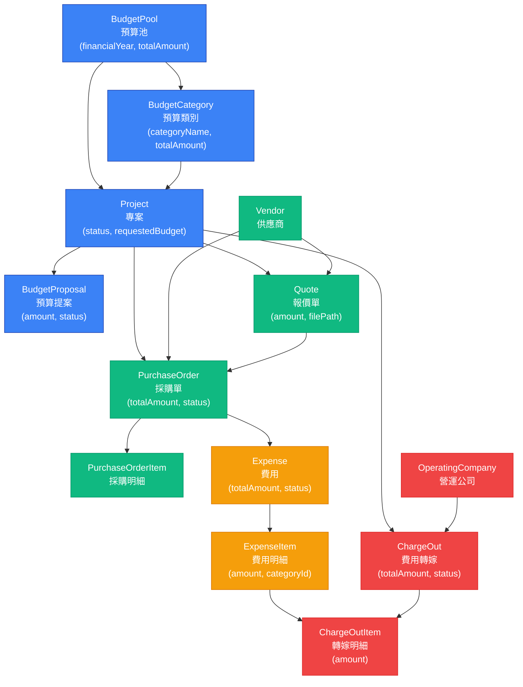
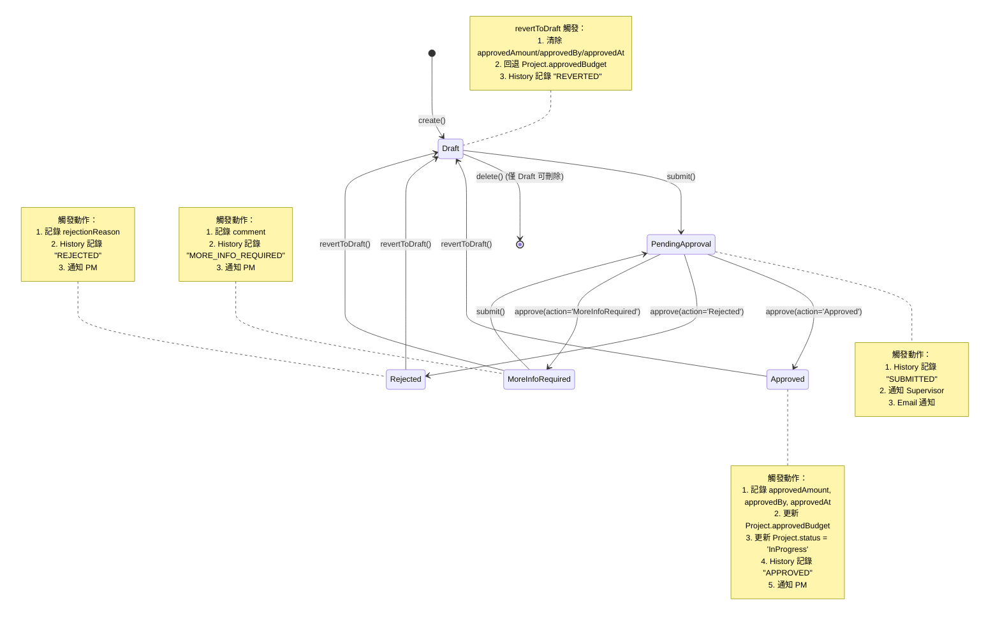
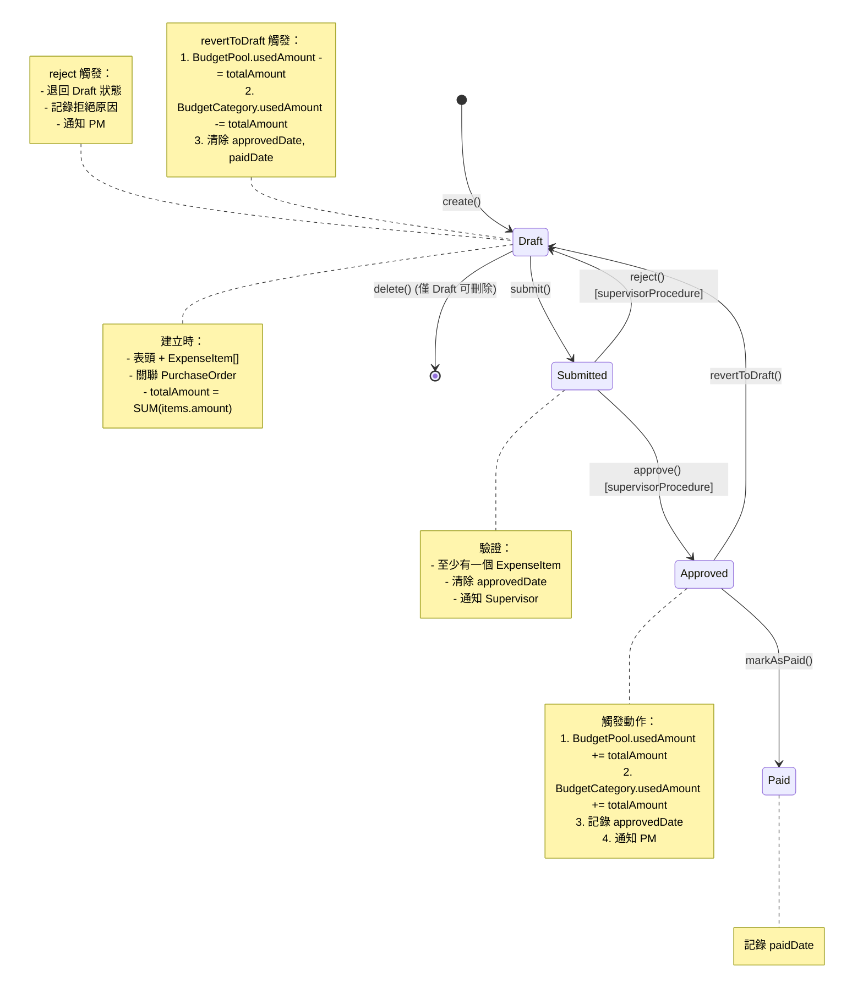
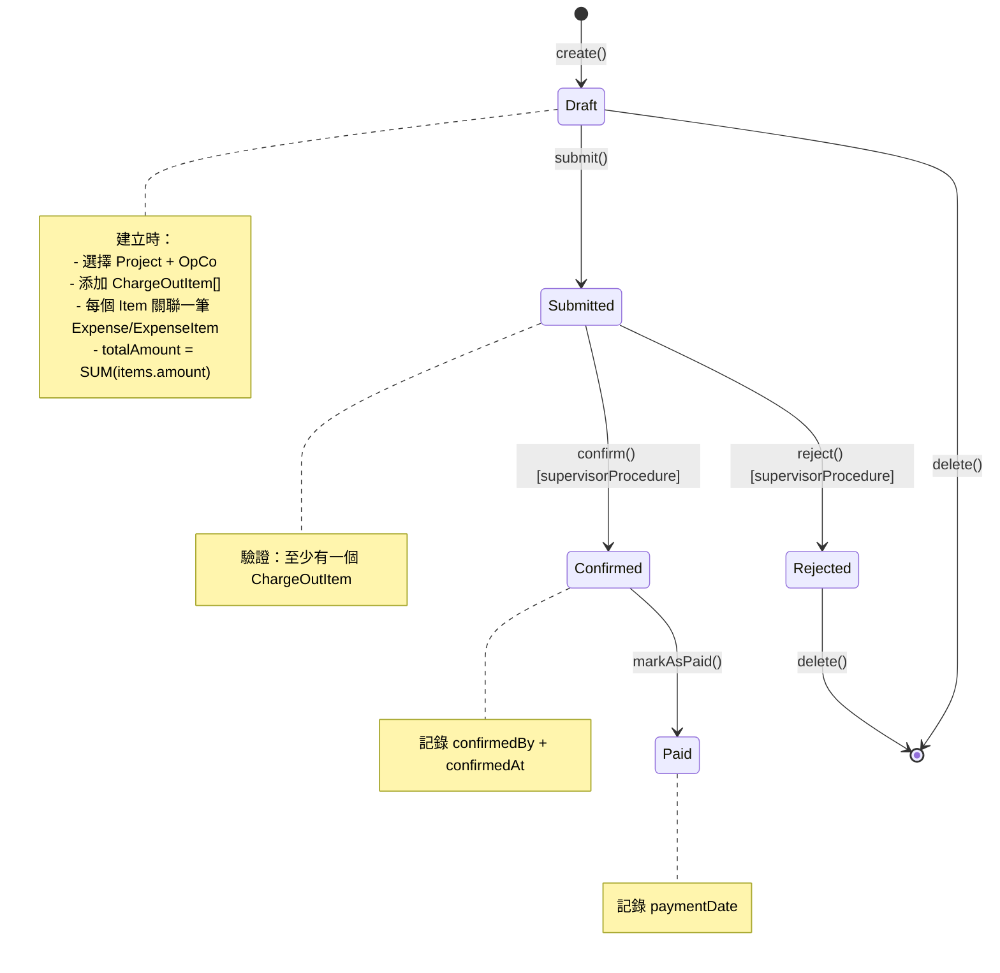
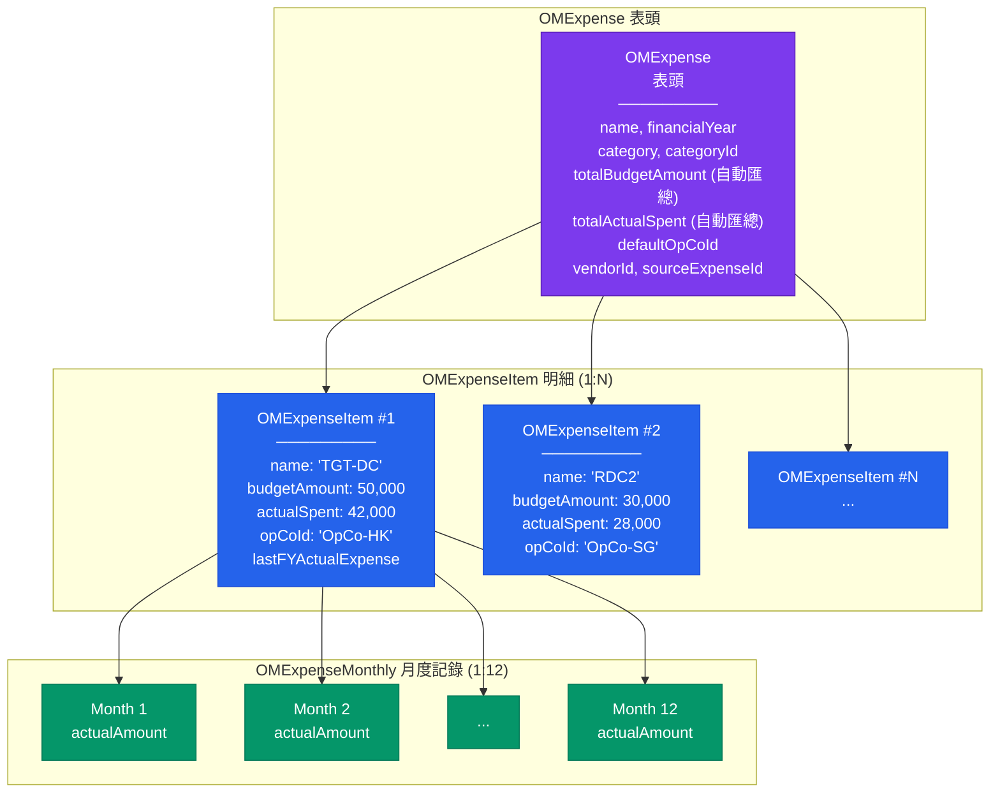
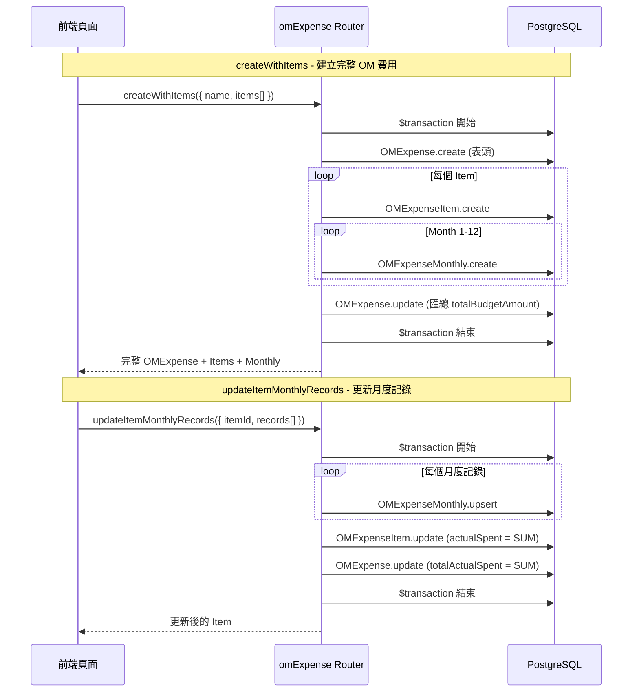
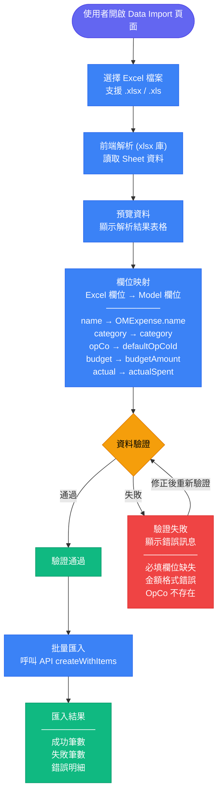
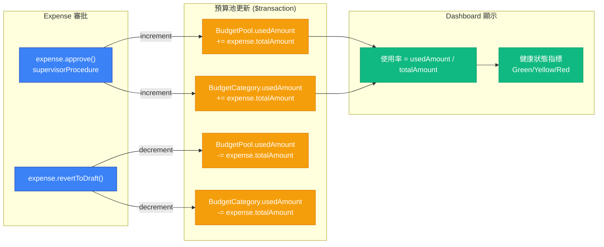
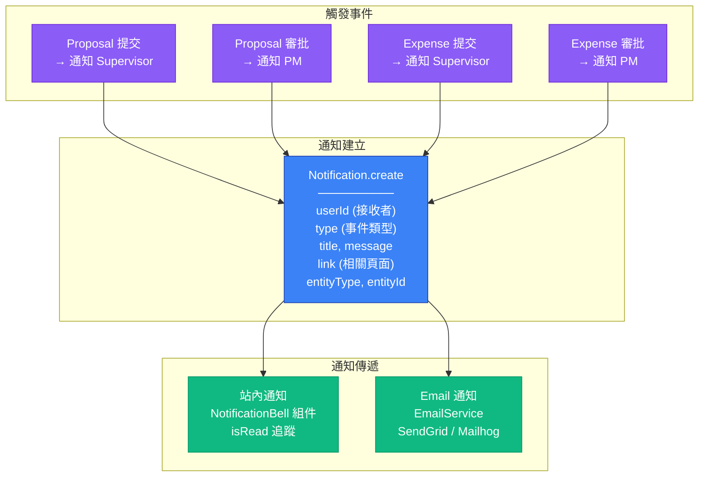

# 資料流圖

本文件描述 IT 專案流程管理平台中各項核心業務流程的資料流向，包含預算審批、費用管理、OM 費用、以及資料匯入等流程。

---

## 1. 核心業務流程總覽

此圖展示從預算池建立到費用轉嫁的完整業務資料流。每個方塊代表一個主要 Prisma Model，箭頭表示資料關聯方向。

---

## 2. 預算提案審批流程

此圖展示 BudgetProposal 的完整狀態流轉，包含每個狀態轉換觸發的資料庫操作和通知。資料來源為 `budgetProposal.ts` router 的 submit、approve 等 procedure。

---

## 3. 費用審批與支付流程

此圖展示 Expense 從建立到支付的完整資料流。approve 動作會觸發預算池自動扣款，reject 會將狀態退回。資料來源為 `expense.ts` router。

---

## 4. 費用轉嫁 (ChargeOut) 流程

此圖展示 ChargeOut 的狀態流轉。ChargeOut 用於將 IT 費用分攤給各營運公司 (OpCo)，需要主管確認。資料來源為 `chargeOut.ts` router。

---

## 5. OM 費用表頭-明細資料流 (FEAT-007)

此圖展示 OM Expense 的三層資料架構：OMExpense (表頭) 包含多個 OMExpenseItem (明細)，每個明細再包含 12 筆 OMExpenseMonthly (月度記錄)。資料來源為 `omExpense.ts` router。

### OM 費用操作資料流

---

## 6. Excel 資料匯入流程 (FEAT-008)

此圖展示 data-import 頁面的資料匯入流程。使用者上傳 Excel 檔案後，前端使用 xlsx 庫解析，經過欄位映射和驗證後，批量建立 OM Expense 記錄。

---

## 7. 預算池使用率即時追蹤 (Epic 6.5)

此圖展示 BudgetPool 和 BudgetCategory 的 usedAmount 如何透過 Expense 審批動作自動更新。

---

## 8. 通知系統資料流 (Epic 8)

此圖展示狀態變更時如何觸發站內通知和 Email 通知。

