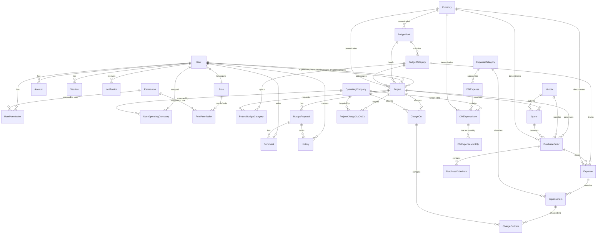
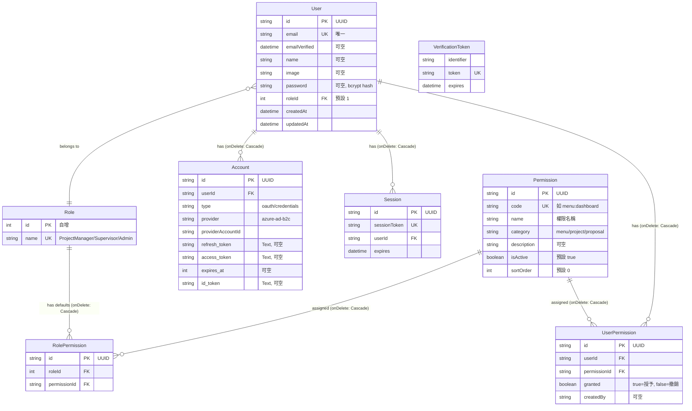
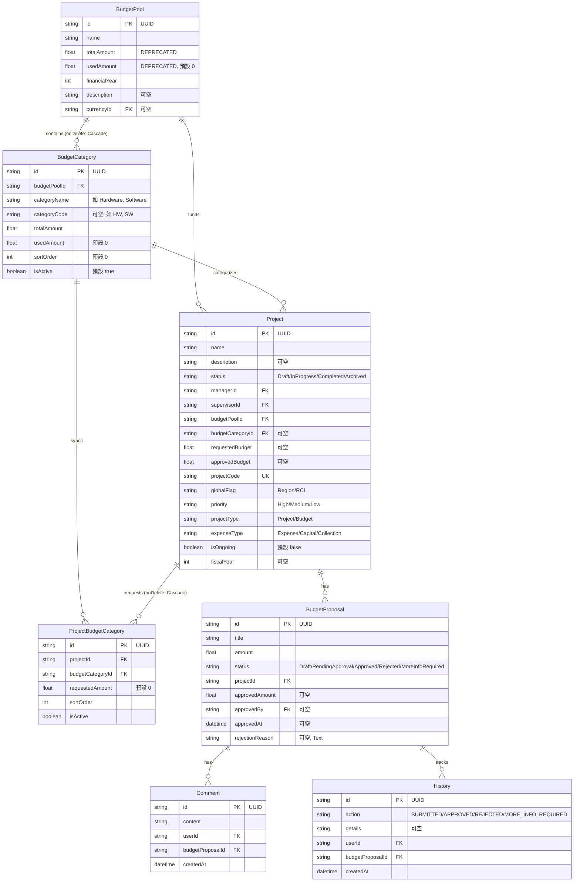
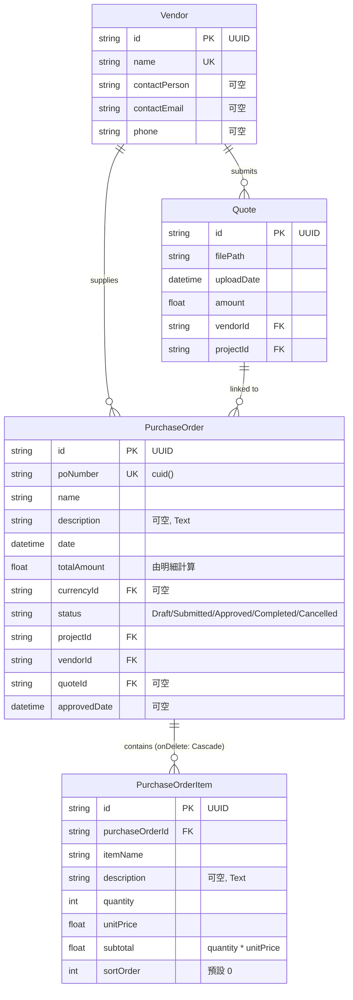
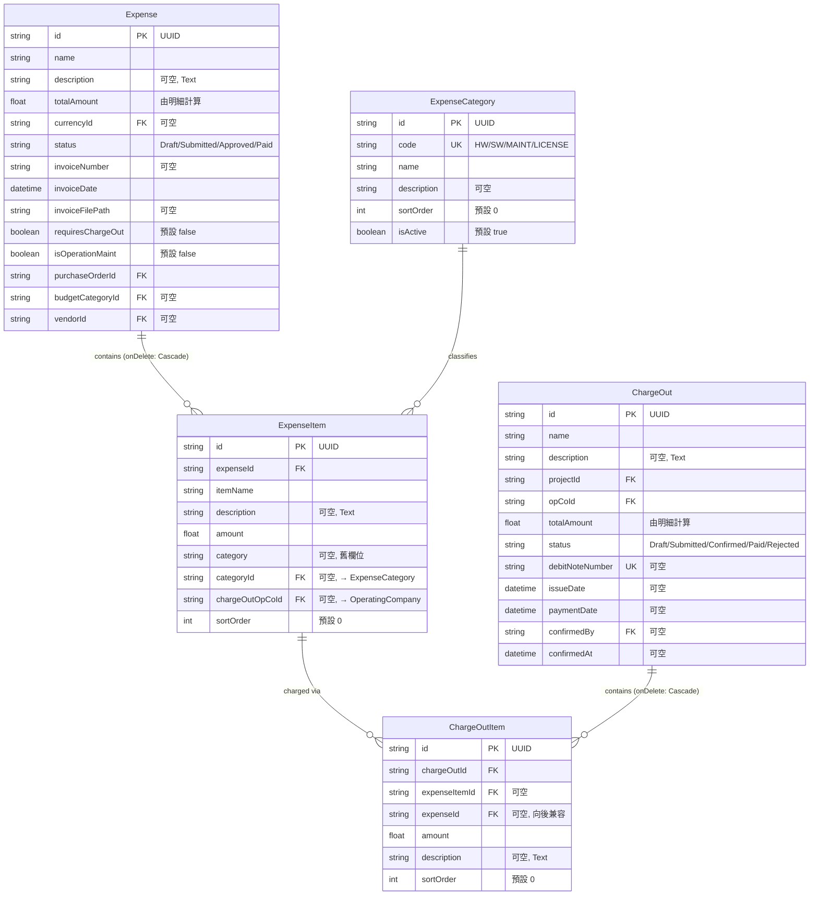
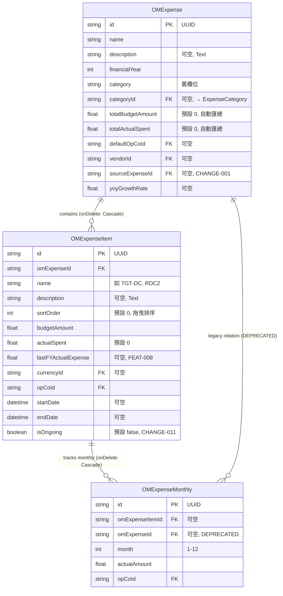
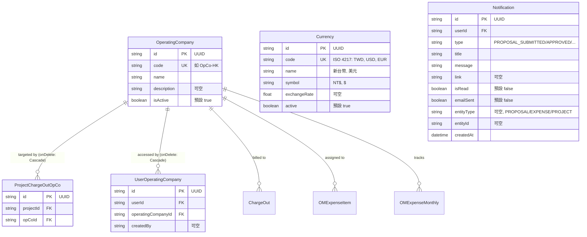

# ER 關聯圖

本文件描述 IT 專案流程管理平台的資料庫 Entity-Relationship 圖。共 31 個 Prisma Model，按業務領域分組呈現。資料來源為 `packages/db/prisma/schema.prisma`。

---

## 1. 完整 ER 總覽 (精簡版)

此圖以精簡方式展示所有 31 個 Model 之間的關聯關係，不顯示欄位細節。

---

## 2. 認證與權限領域 (Auth Domain)

包含使用者、角色、NextAuth 模型，以及 FEAT-011 的權限管理系統。

---

## 3. 預算與專案領域 (Budget Domain)

包含預算池、預算類別、專案、預算提案，以及審批相關的評論和歷史記錄。

---

## 4. 採購與供應商領域 (Procurement Domain)

包含供應商、報價單、採購單及其明細。

---

## 5. 費用領域 (Expense Domain)

包含費用、費用明細、費用轉嫁 (ChargeOut)。

---

## 6. OM 費用領域 (OM Domain)

包含 FEAT-007 重構後的三層架構：OMExpense (表頭) -> OMExpenseItem (明細) -> OMExpenseMonthly (月度記錄)。

---

## 7. 系統輔助領域 (System Domain)

包含營運公司、貨幣、通知，以及使用者與營運公司的權限關聯。

---

## 8. Model 統計

| 領域 | Model 數量 | Models |
|------|-----------|--------|
| 認證與權限 | 8 | User, Role, Account, Session, VerificationToken, Permission, RolePermission, UserPermission |
| 預算與專案 | 6 | BudgetPool, BudgetCategory, Project, ProjectBudgetCategory, BudgetProposal, Comment, History |
| 採購與供應商 | 4 | Vendor, Quote, PurchaseOrder, PurchaseOrderItem |
| 費用管理 | 4 | Expense, ExpenseItem, ExpenseCategory, ChargeOut, ChargeOutItem |
| OM 費用 | 3 | OMExpense, OMExpenseItem, OMExpenseMonthly |
| 系統輔助 | 5 | OperatingCompany, ProjectChargeOutOpCo, UserOperatingCompany, Currency, Notification |
| **總計** | **31** | |
