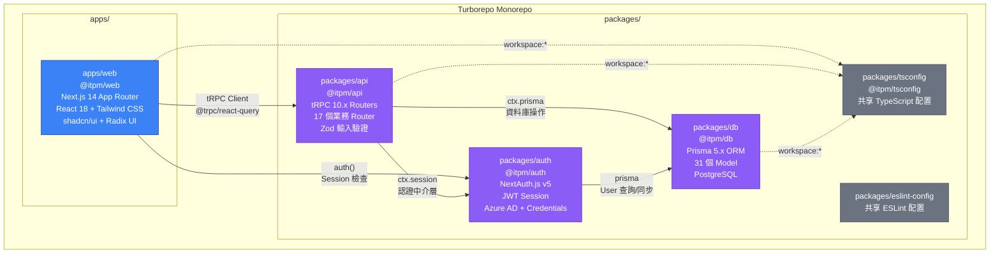
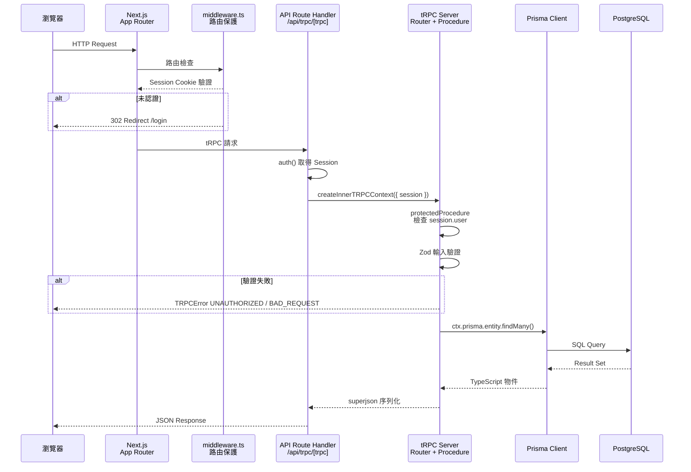
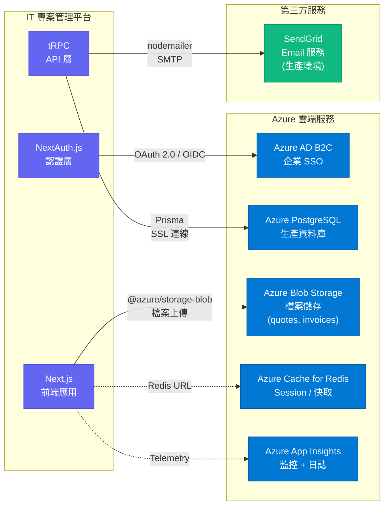
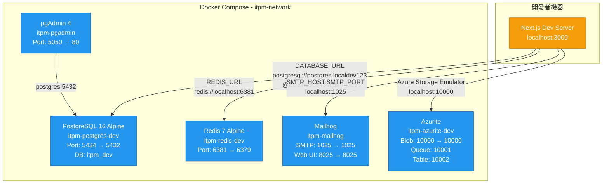
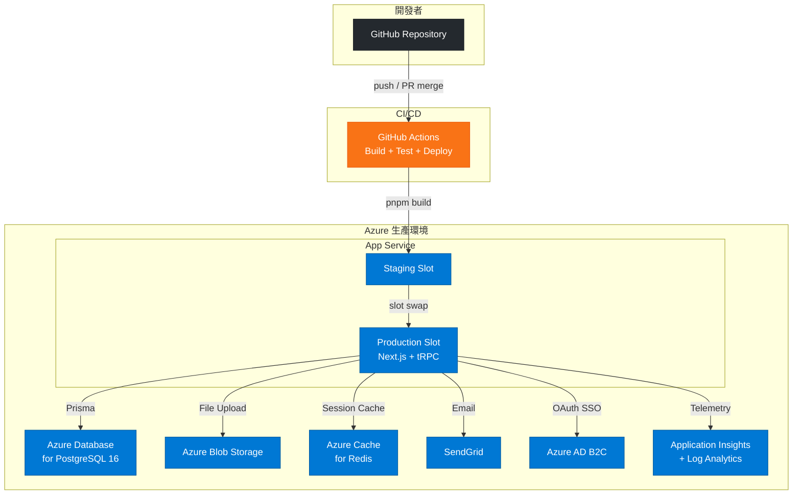
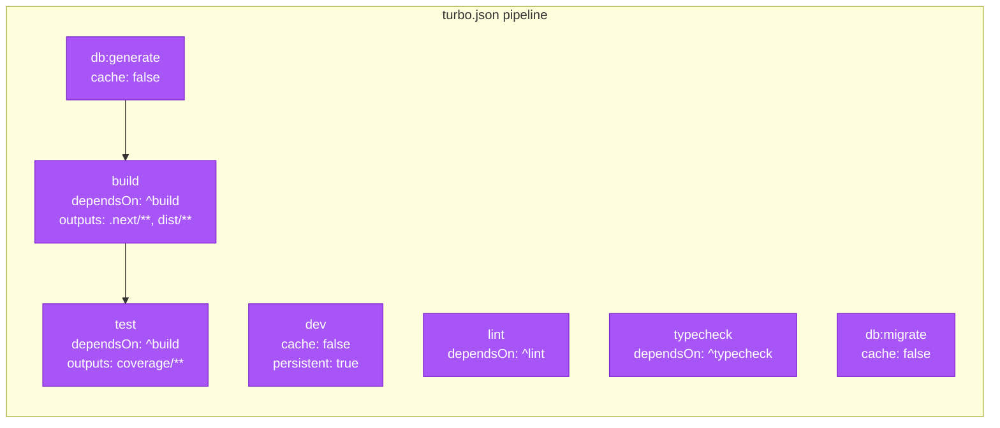

# 系統架構圖

本文件描述 IT 專案流程管理平台的整體系統架構，包含 Monorepo 結構、各層之間的通訊方式、以及外部服務整合。

---

## 1. 高層系統架構

此圖展示整個平台的 Monorepo 組織與內部套件依賴。apps/web 是 Next.js 前端應用，透過 tRPC 呼叫 packages/api 的業務邏輯層，api 層再透過 Prisma ORM 存取 PostgreSQL 資料庫。packages/auth 提供 NextAuth.js 認證服務，被 web 和 api 同時使用。

---

## 2. 請求處理流程

此圖展示一個典型的 API 請求如何從瀏覽器經過各層最終到達資料庫，以及認證是如何在其中運作的。

---

## 3. 外部服務整合

此圖展示平台與外部服務的整合方式。包含 Azure AD B2C 用於企業 SSO 登入、Azure Blob Storage 用於檔案上傳、SendGrid 用於生產環境郵件發送等。

---

## 4. 本機開發環境 (Docker Compose)

此圖展示本機開發時由 docker-compose.yml 啟動的五個容器服務及其連接埠映射。所有服務使用非標準埠以避免衝突。

---

## 5. 部署架構 (Azure App Service)

此圖展示生產環境的 Azure 部署架構，以及 CI/CD 流程。

---

## 6. Turborepo 建構管線

此圖展示 turbo.json 中定義的建構任務依賴關係。build 任務具有 `^build` 依賴，意味著子套件必須先建構完成。

建構順序：
1. `packages/tsconfig` (無依賴)
2. `packages/db` → `db:generate` (Prisma Client)
3. `packages/auth` (依賴 db)
4. `packages/api` (依賴 db, auth)
5. `apps/web` (依賴 api, auth, db)
