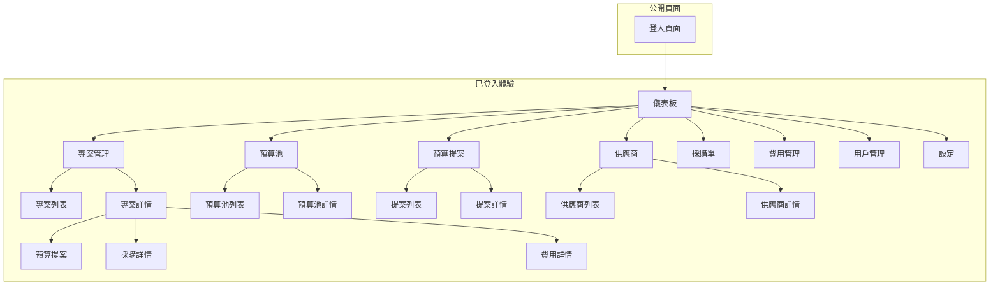
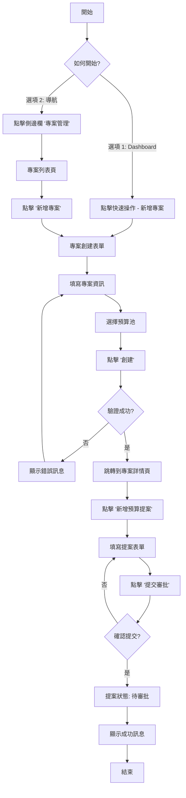

# IT 專案流程管理平台 UI/UX 規格文件

**版本**: 2.0 (完整詳細版)
**日期**: 2025-10-03
**作者**: UX 專家 (Sally)
**狀態**: ✅ 已確認 - 作為前端開發的權威指南

---

## 1. 介紹 (Introduction)

本文件定義了「IT 專案流程管理平台」使用者介面的體驗目標、資訊架構、使用者流程和視覺設計規格。它將作為視覺設計和前端開發的基礎，確保提供一個有凝聚力且以使用者為中心的體驗。

### 1.1 整體 UX 目標與原則

#### 目標使用者畫像 (Target User Personas)

1. **專案經理 (Primary User)**
   - 需要快速創建專案和提案
   - 時間緊迫，經常需要多工處理
   - 期望簡潔、高效的操作流程

2. **主管 (Secondary User)**
   - 需要審批提案和監控專案進度
   - 重視數據視覺化和決策支持
   - 需要清晰的概覽儀表板

3. **系統管理員 (Admin User)**
   - 負責用戶管理和系統設置
   - 需要強大的後台管理功能
   - 重視系統穩定性和安全性

#### 可用性目標 (Usability Goals)

1. **學習容易度**: 新用戶能在 10 分鐘內完成首次專案創建
2. **使用效率**: 熟練用戶可在 30 秒內找到所需的專案或提案資訊
3. **錯誤預防**: 所有關鍵操作都有確認機制
4. **記憶性**: 界面設計直觀，用戶隔週使用仍能快速上手
5. **滿意度**: 提供即時回饋，讓用戶清楚知道系統狀態

#### 設計原則 (Design Principles)

1. **簡潔優先 (Simplicity First)** - 避免功能堆疊，專注核心專案管理場景
2. **即時回應 (Instant Response)** - 操作結果即時顯示，減少等待時間
3. **情境感知 (Context-Aware)** - 根據用戶當前任務智能推薦相關資訊
4. **桌面優先 (Desktop-First)** - 優先考慮筆記型電腦使用場景
5. **資料驅動 (Data-Driven)** - 透過視覺化幫助用戶快速理解複雜數據

### 1.2 類似產品的 UX 模式分析

在企業專案管理領域，領先的產品如 **Asana**, **Monday.com**, **Jira**, 和 **ClickUp** 等，它們的 UX 設計普遍呈現出以下幾種成熟的模式:

#### 1. 儀表板為中心的首頁 (Dashboard-centric Home)
- **模式**: 用戶登入後看到的第一個畫面通常是一個個人化的儀表板
- **內容**: 顯示關鍵績效指標（KPIs）、待辦事項、智慧提醒、以及最近活動的摘要
- **為何有效**: 為專案經理和主管提供了一個快速的每日概覽

#### 2. 側邊欄導航 (Sidebar Navigation)
- **模式**: 左側固定的垂直導航欄
- **內容**: 主要功能模組的快速訪問
- **為何有效**: 提供持續可見的導航，減少點擊次數

#### 3. 卡片式信息呈現 (Card-based UI)
- **模式**: 使用卡片來組織和展示信息
- **為何有效**: 視覺層次清晰，易於掃描和理解

#### 4. 狀態驅動的視覺化 (Status-driven Visualization)
- **模式**: 用顏色、圖標和進度條表示狀態
- **為何有效**: 用戶能一眼看出專案或提案的當前狀態

#### 5. 360 度項目視圖 (360-Degree Project View)
- **模式**: 整合來自多個來源的資訊，在一個統一的介面中呈現
- **為何有效**: 避免了用戶在多個頁面之間來回切換

---

## 2. 資訊架構 (Information Architecture - IA)

### 2.1 網站地圖 / 畫面清單



### 2.2 主導航項目優先級與順序

**建議順序**: Dashboard → Projects → Budget Pools → Budget Proposals → Vendors → Purchase Orders → Expenses → Users

**理由**:
- 專案管理工作流程：概覽 → 專案 → 預算 → 執行 → 回顧
- 將"專案"放在最前面，符合核心工作流程
- 幾乎所有的管理活動都是圍繞著專案展開的

---

## 3. 使用者流程 (User Flows)

### 流程：專案經理創建並提交提案

**使用者目標**: 專案經理創建一個新專案，為其添加預算提案，並提交給主管進行審批。

**進入點**:
- Dashboard 的快速操作
- 主導覽列的 "Projects" 連結
- 專案列表頁的 "新增專案" 按鈕

**成功標準**:
- 使用者在 2 分鐘內創建專案並提交提案
- 系統能正確保存所有數據
- 主管能在其儀表板看到新提案



**邊界與錯誤處理**:
- **表單驗證失敗**: 在對應欄位旁顯示清晰的錯誤提示
- **伺服器錯誤**: 顯示非侵入式的 Toast 通知，允許重試
- **權限不足**: 清晰告知用戶權限問題

---

## 4. 線框圖與視覺稿 (Wireframes & Mockups)

### 設計檔案
- **主要設計檔案**: `[Figma 專案連結]`
- **設計系統**: Tailwind CSS + Headless UI

### 關鍵頁面佈局概念（桌面優先）

#### 1. Dashboard（儀表板）

**用途**: 為使用者提供每日工作的快速概覽和智慧起點

**佈局**: 採用經典的「側邊欄 + 主內容」佈局

```
+--------+-----------------------------------------------------------+
|        |  [TopBar: 搜索框 | 通知 | 用戶頭像]                      |
| 側     +-----------------------------------------------------------+
| 邊     |  [頁面標題: 儀表板]                                       |
| 欄     |                                                           |
|        |  [統計卡片區 - 4個卡片橫向排列]                           |
| 導     |  +-------------+  +-------------+  +-------------+         |
| 航     |  | 本月預算    |  | 進行中專案  |  | 待審批提案  |         |
|        |  | RM 485,200  |  | 24         |  | 32         |         |
|        |  | +12.5% ↑    |  | +8 ↑       |  | -2.1% ↓    |         |
|        |  +-------------+  +-------------+  +-------------+         |
|        |                                                           |
|        |  [主要內容區 - 2欄佈局]                                   |
|        |  +----------------------------------+  +-----------------+ |
|        |  | 銷售趨勢圖表                     |  | 快速操作       | |
|        |  | [柱狀圖 - 6個月數據]             |  | ➕ 新增客戶   | |
|        |  +----------------------------------+  | 💬 AI 助手    | |
|        |                                        | 📋 生成提案   | |
|        |  [最近活動列表 - 全寬]                  | 🔍 知識搜索   | |
|        |  +------------------------------------+ +-----------------+ |
|        |  | ✅ 客戶電話會議 - 1小時前        |                   |
|        |  | ✅ 提案文件生成 - 2小時前        |  [AI 洞察]      |
|        |  | ⏳ 新增客戶 - 3小時前            |  92% 信心度     |
|        |  +------------------------------------+ +-----------------+ |
+--------+-----------------------------------------------------------+
```

**關鍵元素**:
- **頂部搜索框**: 全局搜索功能
- **統計卡片**: 關鍵指標展示，帶趨勢指示
- **圖表區**: 數據可視化
- **快速操作**: 常用功能快捷入口
- **AI 洞察**: 智能建議面板

#### 2. Project Detail View（專案詳情頁）

**用途**: 整合展示關於單個專案的所有信息

**佈局**: 「標籤頁」佈局

```
+--------+-----------------------------------------------------------+
|        |  [TopBar]                                                 |
| 側     +-----------------------------------------------------------+
| 邊     |  [麵包屑: 專案 > ERP系統升級專案]                          |
| 欄     |                                                           |
|        |  **ERP系統升級專案**  [狀態: 進行中]  [編輯]              |
|        |  負責人: 張三 | 預算池: 2024 IT預算池                      |
|        |  ---                                                      |
|        |  [Tab導航: 概覽 | 預算提案 | 採購 | 費用 | 歷史]         |
|        |                                                           |
|        |  [Tab內容區]                                              |
|        |  +-------------------------------------------------------+ |
|        |  | [新增提案按鈕]                                        | |
|        |  |                                                       | |
|        |  | [提案卡片列表]                                        | |
|        |  | +---------------------------------------------------+ | |
|        |  | | **提案 #123** [已批准] ✅                         | | |
|        |  | | 金額: $50,000 | 提交: 2024-09-15                  | | |
|        |  | | [查看詳情]                                        | | |
|        |  | +---------------------------------------------------+ | |
|        |  +-------------------------------------------------------+ |
+--------+-----------------------------------------------------------+
```

#### 3. List View（列表頁面）

**用途**: 展示專案、提案等列表數據

**佈局**: 「篩選器 + 表格」佈局

```
+--------+-----------------------------------------------------------+
|        |  [TopBar]                                                 |
| 側     +-----------------------------------------------------------+
| 邊     |  [頁面標題: 專案管理]  [新增專案按鈕]                     |
| 欄     |                                                           |
|        |  [篩選器列]                                               |
|        |  [狀態: 全部▼] [預算池: 全部▼] [搜索框] [導出▼]          |
|        |                                                           |
|        |  [表格]                                                   |
|        |  +-------------------------------------------------------+ |
|        |  | 專案名稱     | 負責人 | 狀態   | 預算    | 更新時間 | |
|        |  |--------------|--------|--------|---------|----------| |
|        |  | ERP升級      | 張三   | 進行中 | $50,000 | 2天前    | |
|        |  | 雲端遷移     | 李四   | 草稿   | $80,000 | 5小時前  | |
|        |  +-------------------------------------------------------+ |
|        |                                                           |
|        |  [分頁器: ◀ 1 2 3 ... 10 ▶]                             |
+--------+-----------------------------------------------------------+
```

---

## 5. 元件庫 / 設計系統 (Component Library / Design System)

### 5.1 設計系統方法

**採用 Tailwind CSS + Headless UI 作為基礎**

**理由**:
- 高度可客製化
- 優秀的開發體驗
- 完整的無障礙支援
- 與 Next.js 完美整合

### 5.2 核心元件

#### 1. Button (按鈕)

**變體**:
- Primary: 主要操作 (bg-blue-600 hover:bg-blue-700)
- Secondary: 次要操作 (bg-gray-200 hover:bg-gray-300)
- Danger: 危險操作 (bg-red-600 hover:bg-red-700)
- Ghost: 透明按鈕 (hover:bg-gray-100)

**狀態**: default, hover, focus, disabled, loading

**尺寸**: sm (32px), md (40px), lg (48px)

#### 2. Card (卡片)

**變體**:
- Stat Card: 統計數據卡片 (帶圖標和趨勢)
- Content Card: 內容卡片
- Action Card: 可點擊的操作卡片

**視覺元素**:
- 背景: bg-white
- 邊框: border border-gray-200
- 圓角: rounded-xl
- 陰影: shadow-sm hover:shadow-md
- 內距: p-6

#### 3. Input (輸入框)

**類型**: text, email, number, textarea, select

**狀態**: default, focus, error, disabled

**視覺元素**:
- 邊框: border border-gray-300
- 聚焦: focus:border-blue-500 focus:ring-1 focus:ring-blue-500
- 錯誤: border-red-500

#### 4. Table (表格)

**功能**: 排序、篩選、分頁、選擇

**視覺元素**:
- 標題行: bg-gray-50
- 分隔線: border-b border-gray-200
- 懸浮: hover:bg-gray-50

#### 5. Modal (彈出窗)

**類型**: 確認對話框、表單對話框、全屏模態

**功能**: 關閉按鈕、背景遮罩、鍵盤快捷鍵

#### 6. Toast (通知)

**類型**: success, error, warning, info

**位置**: 右上角

**自動關閉**: 3-5秒

---

## 6. 品牌與樣式指南 (Branding & Style Guide)

### 6.1 色彩搭配 (Color Palette)

| 顏色類型 | Hex 色碼 | Tailwind | 用途說明 |
|---------|---------|----------|---------|
| **主色 (Primary)** | `#0052CC` | `blue-600` | 主要按鈕、活動連結、焦點元素 |
| **主色 Hover** | `#0747A6` | `blue-700` | 按鈕懸浮狀態 |
| **輔色 (Secondary)** | `#42526E` | `gray-600` | 次要按鈕、邊框 |
| **強調色 (Accent)** | `#FFAB00` | `yellow-400` | 提醒、新功能 |
| **成功色 (Success)** | `#00875A` | `green-600` | 成功訊息、已批准 |
| **警告色 (Warning)** | `#FFC400` | `yellow-500` | 警告提示 |
| **錯誤色 (Error)** | `#DE350B` | `red-600` | 錯誤訊息、刪除 |
| **中性色** | | | |
| 深黑 | `#172B4D` | `gray-900` | 主要標題 |
| 中黑 | `#5E6C84` | `gray-600` | 正文文字 |
| 淺灰 | `#DFE1E6` | `gray-200` | 邊框、分隔線 |
| 背景灰 | `#F4F5F7` | `gray-50` | 頁面背景 |
| 白色 | `#FFFFFF` | `white` | 卡片背景 |

### 6.2 字體排印 (Typography)

**字體家族**: Inter (無襯線字體)

**字體層級**:

| 元素 | 大小 | 字重 | 行高 | Tailwind Class |
|-----|------|------|------|----------------|
| H1 | 32px | Bold (700) | 40px | `text-3xl font-bold` |
| H2 | 24px | Semi-bold (600) | 32px | `text-2xl font-semibold` |
| H3 | 20px | Semi-bold (600) | 28px | `text-xl font-semibold` |
| H4 | 16px | Medium (500) | 24px | `text-base font-medium` |
| Body | 14px | Regular (400) | 20px | `text-sm` |
| Small | 12px | Regular (400) | 16px | `text-xs` |

### 6.3 圖示系統

**選擇**: Heroicons 2.0

**理由**:
- 與 Tailwind 同一團隊開發
- 風格現代且一致
- 完整的 outline 和 solid 變體
- 優秀的 React 支援

**核心功能圖標**:

| 導航項目 | 圖標名稱 | 圖標 |
|---------|---------|------|
| Dashboard | HomeIcon | 🏠 |
| Projects | FolderIcon | 📁 |
| Budget Pools | CurrencyDollarIcon | 💰 |
| Proposals | DocumentTextIcon | 📄 |
| Vendors | BuildingStorefrontIcon | 🏪 |
| Purchase Orders | ShoppingCartIcon | 🛒 |
| Expenses | ReceiptPercentIcon | 🧾 |
| Users | UsersIcon | 👥 |

### 6.4 間距系統 (Spacing)

**基於 8px 網格系統**:

| Token | 尺寸 | Tailwind | 用途 |
|-------|------|----------|------|
| space-1 | 4px | `1` | 細微調整 |
| space-2 | 8px | `2` | 小元件內距 |
| space-3 | 12px | `3` | 元件間距 |
| space-4 | 16px | `4` | 標準間距 |
| space-6 | 24px | `6` | 區塊間距 |
| space-8 | 32px | `8` | 大區塊間距 |

### 6.5 Tailwind 配置

```javascript
// tailwind.config.js
module.exports = {
  theme: {
    extend: {
      colors: {
        primary: {
          DEFAULT: '#0052CC',
          hover: '#0747A6',
        },
        accent: '#FFAB00',
      },
      fontFamily: {
        sans: ['Inter', 'sans-serif'],
      },
      borderRadius: {
        'xl': '12px',
      },
      boxShadow: {
        'card': '0 1px 3px rgba(0, 0, 0, 0.1)',
        'card-hover': '0 4px 8px rgba(0, 0, 0, 0.15)',
      },
    },
  },
}
```

---

## 7. 無障礙需求 (Accessibility Requirements)

### 合規目標
**標準**: WCAG 2.1 AA 級別

### 關鍵需求

#### 視覺方面
- **色彩對比度**: 所有文字與背景的對比度至少為 4.5:1
- **焦點指示器**: 清晰可見的 focus ring
- **非色彩依賴**: 不單獨使用顏色傳達信息

#### 互動方面
- **鍵盤導覽**: 所有功能都可用鍵盤操作
- **螢幕閱讀器**: 使用語義化 HTML 和 ARIA 屬性
- **觸控目標**: 至少 44x44px

---

## 8. 響應式設計策略

### 斷點定義

| 斷點名稱 | 最小寬度 | Tailwind | 目標設備 |
|---------|---------|----------|---------|
| Mobile | 320px | `sm:` | 手機 |
| Tablet | 768px | `md:` | 平板 |
| Desktop | 1024px | `lg:` | 筆記型電腦 |
| Wide | 1280px | `xl:` | 大螢幕 |

### 適應模式

- **Desktop**: 完整三欄佈局
- **Tablet**: 兩欄佈局，側邊欄可收起
- **Mobile**: 單欄佈局，漢堡菜單

---

## 9. 動畫與微交互

### 過渡動畫

**頁面切換**: 200ms fade
**展開/折疊**: 250ms ease-in-out
**懸浮效果**: 150ms

### Tailwind 動畫類

```css
/* 標準過渡 */
transition-colors duration-150
transition-shadow duration-150

/* 載入動畫 */
animate-spin
animate-pulse
```

---

## 10. 效能考量

### 效能目標

- **FCP (First Contentful Paint)**: < 1.8s
- **LCP (Largest Contentful Paint)**: < 2.5s
- **FID (First Input Delay)**: < 100ms

### 優化策略

1. **圖片優化**: WebP 格式、懶加載
2. **字體優化**: 預載入、font-display: swap
3. **代碼分割**: 動態 import
4. **列表虛擬化**: 超過 100 項使用虛擬滾動

---

## 11. 實現檢查清單

### 設計系統
- ✅ Tailwind CSS 配置完成
- ✅ Heroicons 安裝
- ✅ Inter 字體載入
- ⬜ 完整元件庫建立

### 核心頁面
- ✅ Dashboard 基礎佈局
- ✅ 側邊欄導航
- ✅ 頂部導航欄
- ⬜ 專案列表頁
- ⬜ 專案詳情頁
- ⬜ 提案管理頁

### 元件開發
- ✅ Button 組件
- ✅ Card 組件
- ⬜ Table 組件
- ⬜ Modal 組件
- ⬜ Form 組件
- ⬜ Toast 通知

---

*文檔版本 2.0 - 完整前端設計規格*
