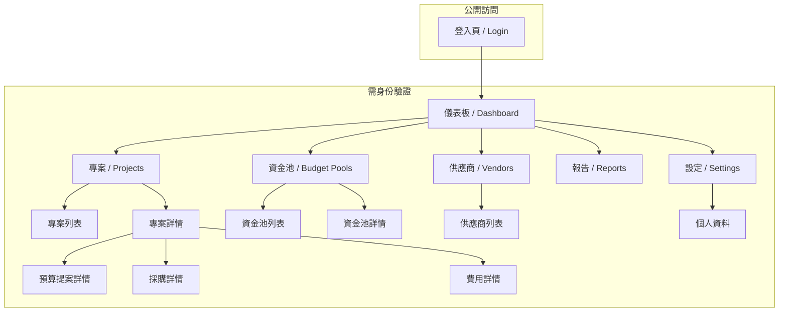
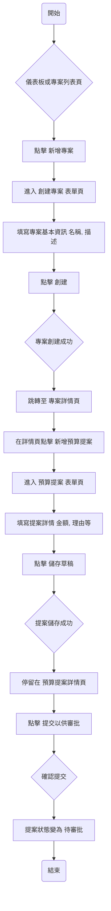
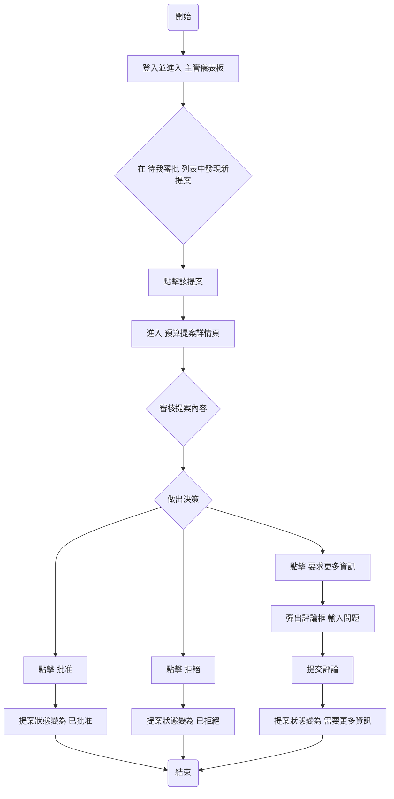

# IT 專案流程管理平台 UI/UX 規格文件

**版本：** 1.0
**日期：** 2025-10-02
**作者：** UX 專家 (Sally)

---

## 1. 介紹 (Introduction)

本文件定義了「IT 專案流程管理平台」的使用者體驗 (UX) 目標、資訊架構、使用者流程和初步的視覺設計規格。它將作為後續視覺稿設計與前端開發的權威指南，以確保我們打造出一個具有凝聚力、以使用者為中心的優秀產品。

### 1.1. 整體 UX 目標與原則

#### 1.1.1. 使用者體驗目標 (Usability Goals)
*   **高效 (Efficiency):** 使用者應能以最少的點擊和最短的路徑完成核心任務。介面必須反應迅速，避免不必要的等待。
*   **掌控感 (Control):** 系統的當前狀態和下一步操作應永遠清晰可見。使用者應對自己的操作充滿信心，並能得到即時、明確的系統反饋。
*   **輕鬆 (Effortless):** 介面應極其直觀，減少使用者的認知負荷。新使用者無需冗長培訓，即可上手完成核心任務。

#### 1.1.2. 設計原則 (Design Principles)
1.  **簡潔至上 (Simplicity First):** 優先考慮清晰度，移除所有非必要的視覺元素和功能。螢幕上的每一個元件都必須服務於一個明確的目的。
2.  **專業可靠 (Professional & Reliable):** 視覺設計應透過一致、精緻且結構化的呈現，來建立使用者對平台的信任感和專業感。
3.  **漸進式揭示 (Progressive Disclosure):** 預設只展示當前情境下最重要的資訊和操作。將進階或次要的功能隱藏起來，直到使用者明確需要它們時才出現。
4.  **清晰的反饋 (Clear Feedback):** 每一個使用者的操作——從點擊按鈕到提交表單——都必須得到一個即時且毫不含糊的視覺響應。

### 1.2. 變更日誌 (Change Log)

| 日期 | 版本 | 描述 | 作者 |
| :--- | :--- | :--- | :--- |
| 2025-10-02 | 1.0 | 初始草稿，定義核心 UX 原則與資訊架構。 | Sally |

---

## 2. 資訊架構 (Information Architecture)

### 2.1. 站點地圖 / 畫面清單 (Site Map / Screen Inventory)

以下是平台核心功能模組的站點地圖，它定義了應用的主要頁面結構。



### 2.2. 導航結構 (Navigation Structure)

*   **主要導航:** 採用左側垂直導航欄的佈局。導航欄將包含站點地圖中的頂級項目：儀表板、專案、資金池、供應商、報告和設定。
*   **次要導航/麵包屑 (Breadcrumbs):** 在複雜的頁面（如「專案詳情」）的頂部，將使用麵包屑導航，以清晰地標示使用者在應用程式中的當前位置（例如：`專案 > 專案 A > 預算提案 #123`）。
*   **使用者選單:** 右上角將包含一個使用者頭像，點擊後會彈出選單，提供「個人資料」和「登出」的選項。

---

## 3. 使用者流程 (User Flows)

本章節定義了使用者為完成核心目標而在平台中採取的路徑。

### 3.1. 流程一：專案經理創建並提交提案

**使用者目標:** 專案經理創建一個新專案，為其添加預算提案，並提交給主管進行審批。



**邊界情況與錯誤處理:**
*   表單驗證失敗時，應在對應欄位旁顯示清晰的錯誤提示。
*   如果伺服器創建失敗，應顯示一個非侵入式的錯誤通知 (Toast Notification)，並允許使用者重試。

### 3.2. 流程二：主管審批提案

**使用者目標:** 主管在其儀表板上發現待審批的提案，並對其進行審批。



**邊界情況與錯誤處理:**
*   如果專案經理在主管審核期間撤回了提案（未來功能），儀表板列表應即時更新。
*   提交決策時如遇伺服器錯誤，應提示主管重試。

---

## 4. 線框稿與佈局 (Wireframes & Layouts)

本章節使用文字描述和區塊佈局來定義關鍵頁面的線框稿，專注於結構和功能，而非視覺風格。

### 4.1. 佈局基礎：主體結構

所有需要身份驗證的頁面都將遵循一個統一的佈局結構：

```
+--------------------------------+--------------------------------------+
|                                |                                      |
|  左側導航欄 (固定)             |      頂部標頭 (Header)               |
|  (App Navigation)              |                                      |
|                                +--------------------------------------+
|                                |                                      |
|                                |                                      |
|                                |      主內容區 (Main Content)         |
|                                |                                      |
|                                |                                      |
|                                |                                      |
|                                |                                      |
+--------------------------------+--------------------------------------+
```

*   **左側導航欄:** 包含指向儀表板、專案、資金池等主要功能區的連結。
*   **頂部標頭:** 包含當前頁面的麵包屑導航和右上角的使用者個人資料選單。
*   **主內容區:** 根據不同頁面，呈現其核心內容。

### 4.2. 關鍵頁面線框稿

#### 4.2.1. 主管儀表板

**目標:** 提供宏觀的、數據驅動的決策支持視圖。

```
+--------------------------------------------------------------------------+
| [麵包屑: / 儀表板]                                 [使用者頭像]        |
+--------------------------------------------------------------------------+
|                                                                          |
|  **資金池預算概覽 (Budget Pool Overview)**                                 |
|  +-----------------+  +-----------------+  +-----------------+           |
|  | [資金池 A 卡片] |  | [資金池 B 卡片] |  | [資金池 C 卡片] |  ...        |
|  | 總預算: xxx     |  | 總預算: yyy     |  | 總預算: zzz     |           |
|  | 剩餘: xxx       |  | 剩餘: yyy       |  | 剩餘: zzz       |           |
|  | [進度條]        |  | [進度條]        |  | [進度條]        |           |
|  +-----------------+  +-----------------+  +-----------------+           |
|                                                                          |
|  **專案總覽 (Project Overview)**                                         |
|  +----------------------------------------------------------------------+ |
|  | [篩選器: 狀態(全部/待審批/進行中)] [搜尋框]  [導出按鈕]             | |
|  +----------------------------------------------------------------------+ |
|  | [表格/列表]                                                          | |
|  | | 專案名稱 | 負責人 | 狀態 | 預算 | 最後更新 |                        | |
|  | |----------|--------|------|------|----------|                        | |
|  | | 專案 X   |  PM A  | 待審批 | $10k | 2天前   |                        | |
|  | | 專案 Y   |  PM B  | 已批准 | $25k | 5小時前 |                        | |
|  +----------------------------------------------------------------------+ |
|                                                                          |
+--------------------------------------------------------------------------+
```

#### 4.2.2. 專案經理儀表板

**目標:** 提供一個以行動為導向的、清晰的工作台。

```
+--------------------------------------------------------------------------+
| [麵包屑: / 儀表板]                                 [使用者頭像]        |
+--------------------------------------------------------------------------+
|                                                                          |
|  **待我處理的任務 (Action Items)**                                       |
|  +----------------------------------------------------------------------+ |
|  | [列表]                                                               | |
|  | - 提案 "ABC" 需要更多資訊  (來自: 主管 Z)  [查看詳情]               | |
|  | - 費用 "XYZ" 已被批准      (來自: 系統通知) [查看詳情]               | |
|  +----------------------------------------------------------------------+ |
|                                                                          |
|  **我負責的專案 (My Projects)**                                          |
|  +----------------------------------------------------------------------+ |
|  | [篩選器: 狀態] [搜尋框] [新增專案按鈕] [導出按鈕]                  | |
|  +----------------------------------------------------------------------+ |
|  | [表格/列表]                                                          | |
|  | | 專案名稱 | 狀態 | 總預算 | 剩餘預算 | 最後更新 |                     | |
|  | |----------|------|--------|----------|----------|                     | |
|  | | 專案 A   | 進行中 | $50k   | $12k     | 1天前    |                     | |
|  | | 專案 B   | 已完成 | $30k   | $2k      | 2週前    |                     | |
|  +----------------------------------------------------------------------+ |
|                                                                          |
+--------------------------------------------------------------------------+
```

#### 4.2.3. 專案詳情頁

**目標:** 作為單一專案的資訊聚合中心，清晰地展示其生命週期中的所有環節。

```
+--------------------------------------------------------------------------+
| [麵包屑: / 專案 / 專案 A]                             [使用者頭像]       |
+--------------------------------------------------------------------------+
|                                                                          |
|  **專案 A**  [狀態: 進行中] [編輯按鈕]                                   |
|  *負責人: PM A*  *資金池: 資金池 B*                                       |
|  ---                                                                     |
|  [分頁導航: 概覽 | 預算提案 | 採購 | 費用 | 歷史記錄]                   |
|                                                                          |
|  **[當前選中的分頁內容]**                                                |
|  (例如: "預算提案" 分頁)                                                 |
|  +----------------------------------------------------------------------+ |
|  | [新增提案按鈕]                                                       | |
|  | +------------------------------------------------------------------+ |
|  | | **提案 #123** [狀態: 已批准]                                     | |
|  | | 提交日期: ... | 批准日期: ... | 金額: ...                        | |
|  | | [查看詳情按鈕]                                                   | |
|  | +------------------------------------------------------------------+ |
|  +----------------------------------------------------------------------+ |
|                                                                          |
+--------------------------------------------------------------------------+
```

---

## 5. 品牌與風格指南 (Branding & Style Guide)

本章節定義了平台的基礎視覺風格，以確保一致性、專業性和易用性。

### 5.1. 色彩搭配 (Color Palette)

我們採用一套以藍色為主、專業且現代的色板。

| 類型 (Type) | 顏色 (Color) | Hex Code | 用途 (Usage) |
| :--- | :--- | :--- | :--- |
| **主色 (Primary)** | 主藍 | `#0052CC` | 主要按鈕、連結、焦點元素 |
| **輔色 (Secondary)** | 深灰 | `#42526E` | 次要文字、邊框、背景 |
| **強調色 (Accent)** | 亮藍 | `#4C9AFF` | 滑鼠懸停效果、選中狀態 |
| **成功 (Success)** | 綠色 | `#00875A` | 成功通知、驗證通過 |
| **警告 (Warning)** | 黃色 | `#FFAB00` | 警告提示、需要注意的資訊 |
| **危險 (Danger)** | 紅色 | `#DE350B` | 錯誤訊息、刪除操作 |
| **中性色 (Neutral)** | | | |
| | 深黑 | `#172B4D` | 主要標題文字 |
| | 中黑 | `#5E6C84` | 正文文字 |
| | 淺灰 | `#DFE1E6` | 邊框、分隔線 |
| | 背景灰 | `#F4F5F7` | 頁面背景 |
| | 白色 | `#FFFFFF` | 卡片背景、按鈕文字 |

### 5.2. 字體排印 (Typography)

我們將使用 `Inter` 作為主要字體，它是一款專為螢幕閱讀設計的現代無襯線字體，清晰易讀。

#### 5.2.1. 字體家族 (Font Families)
*   **主要字體:** `Inter, sans-serif`
*   **等寬字體 (Monospace):** `Source Code Pro, monospace` (用於顯示程式碼或數據)

#### 5.2.2. 字體層級 (Type Scale)

| 元素 (Element) | 字體大小 (Size) | 字重 (Weight) | 行高 (Line Height) | 用途 |
| :--- | :--- | :--- | :--- | :--- |
| **H1 (特大標題)** | 32px | 600 (Semi-bold) | 40px | 頁面主標題 |
| **H2 (大標題)** | 24px | 600 (Semi-bold) | 32px | 區塊主標題 |
| **H3 (中標題)** | 20px | 500 (Medium) | 28px | 子區塊標題 |
| **H4 (小標題)** | 16px | 500 (Medium) | 24px | 卡片標題 |
| **Body (正文)** | 14px | 400 (Regular) | 20px | 主要段落文字 |
| **Small (輔助文字)** | 12px | 400 (Regular) | 16px | 提示、標籤、元數據 |

### 5.3. 間距與佈局 (Spacing & Layout)

我們採用基於 **8px** 的網格系統來確保佈局的一致性和和諧感。所有元件之間的間距都應為 8 的倍數。

#### 5.3.1. 間距量表 (Spacing Scale)

| 變數 (Token) | 尺寸 (px) | 用途 |
| :--- | :--- | :--- |
| `space.1` | 4px | 細微調整 |
| `space.2` | 8px | 小元件內部間距 |
| `space.3` | 16px | 元件與元件之間的標準間距 |
| `space.4` | 24px | 緊密相關的區塊間距 |
| `space.5` | 32px | 主要區塊之間的間距 |
| `space.6` | 48px | 頁面主要分區的大間距 |

#### 5.3.2. 佈局網格 (Layout Grid)
*   主內容區的最大寬度應限制在 `1280px` 以內，並在頁面中水平置中，以確保在寬螢幕上的可讀性。
*   對於複雜的佈局，應優先使用 CSS Grid 或 Flexbox 來實現對齊和分佈。

---

## 6. 下一步 (Next Steps)

本 UI/UX 規格文件為專案的前端設計和整體架構提供了堅實的基礎。

**交接給架構師 (Architect):**

> **你好，Winston (架構師)。**
>
> 這份 UI/UX 規格文件 (`front-end-spec.md`) 已經由 UX 專家 (Sally) 和專案關係人共同審閱並確立。它詳細定義了我們「IT 專案流程管理平台」的使用者流程、資訊架構、關鍵頁面佈局和視覺設計基礎。
>
> 你的下一個任務是基於這份規格文件，以及我們已經完成的 `prd.md`，來創建一份詳細的 **`全端架構文件 (fullstack-architecture.md)`**。
>
> **在你的架構設計中，請特別關注以下幾點：**
> 1.  **技術選型:** 根據我們「現代 & 簡潔」的風格，選擇合適的前後端框架、資料庫和部署策略。
> 2.  **元件化策略:** 設計一個可擴展、可重用的前端元件架構。
> 3.  **API 設計:** 設計出能夠高效支持我們定義的儀表板和專案詳情頁數據需求的 API。
> 4.  **數據模型:** 根據使用者流程，設計出能夠支撐整個六步流程的數據庫模型。
>
> 請開始你的工作。我們期待你的技術藍圖。
