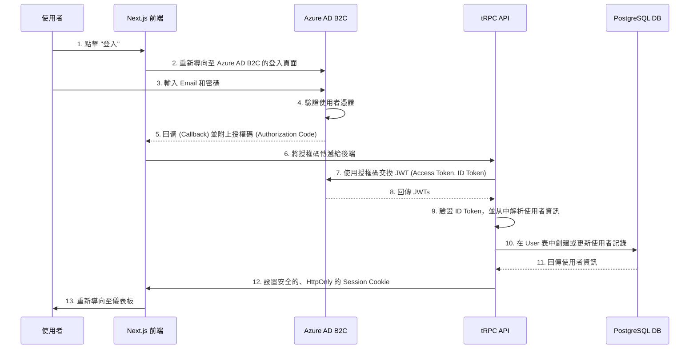
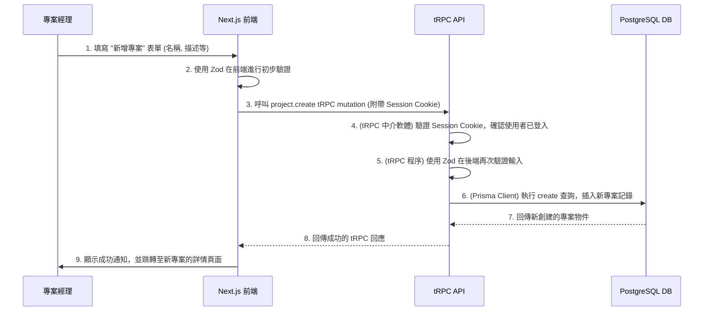

# 8. 核心工作流程 (Core Workflows)

本章節使用序列圖來描繪關鍵業務流程中的元件互動。

### 8.1. 使用者登入與身份驗證

此流程展示了使用者如何透過 **Azure AD B2C** 進行身份驗證，並在我們的系統中建立會話。

```mermaid
sequenceDiagram
    participant User as 使用者
    participant WebApp as Next.js 前端
    participant Azure as Azure AD B2C
    participant Backend as tRPC API
    participant DB as PostgreSQL DB

    User->>WebApp: 1. 點擊 "登入"
    WebApp->>Azure: 2. 重新導向至 Azure AD B2C 的登入頁面
    User->>Azure: 3. 輸入 Email 和密碼
    Azure->>Azure: 4. 驗證使用者憑證
    Azure-->>WebApp: 5. 回调 (Callback) 並附上授權碼 (Authorization Code)
    WebApp->>Backend: 6. 將授權碼傳遞給後端
    Backend->>Azure: 7. 使用授權碼交換 JWT (Access Token, ID Token)
    Azure-->>Backend: 8. 回傳 JWTs
    Backend->>Backend: 9. 驗證 ID Token，並从中解析使用者資訊
    Backend->>DB: 10. 在 User 表中創建或更新使用者記錄
    DB-->>Backend: 11. 回傳使用者資訊
    Backend->>WebApp: 12. 設置安全的、HttpOnly 的 Session Cookie
    WebApp->>User: 13. 重新導向至儀表板
```

### 8.2. 專案經理創建新專案

此流程展示了已登入的專案經理如何創建一個新的專案。

```mermaid
sequenceDiagram
    participant User as 專案經理
    participant WebApp as Next.js 前端
    participant Backend as tRPC API
    participant DB as PostgreSQL DB

    User->>WebApp: 1. 填寫 "新增專案" 表單 (名稱, 描述等)
    WebApp->>WebApp: 2. 使用 Zod 在前端進行初步驗證
    WebApp->>Backend: 3. 呼叫 project.create tRPC mutation (附帶 Session Cookie)
    Backend->>Backend: 4. (tRPC 中介軟體) 驗證 Session Cookie，確認使用者已登入
    Backend->>Backend: 5. (tRPC 程序) 使用 Zod 在後端再次驗證輸入
    Backend->>DB: 6. (Prisma Client) 執行 create 查詢，插入新專案記錄
    DB-->>Backend: 7. 回傳新創建的專案物件
    Backend-->>WebApp: 8. 回傳成功的 tRPC 回應
    WebApp->>User: 9. 顯示成功通知，並跳轉至新專案的詳情頁面
```
